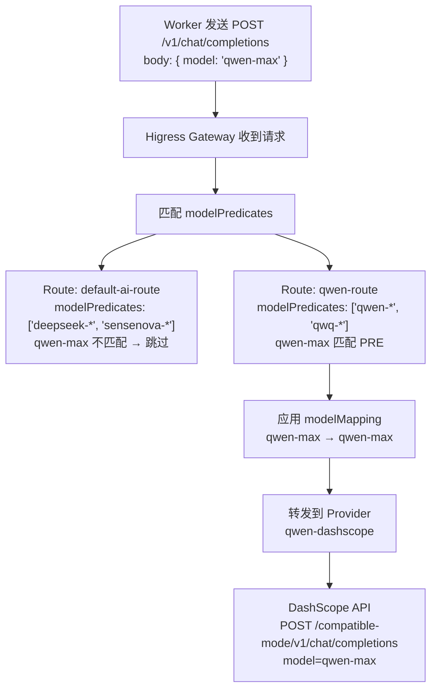

# AI 网关多服务商路由指南

## 架构概览

```
Dashboard (13000) ──── 代理 ────> Controller ──── 配置下发 ────> Worker / Manager
                                        │
                                        │ Higress Console API
                                        ▼
                               Higress AI Gateway (18001)
                                        │
                          ┌─────────────┼─────────────┐
                          ▼             ▼             ▼
                      Ark/Volces    SenseNova      自定义 LLM
                      (Kimi)        (DeepSeek)
```

三层 API 调用栈:

| 层 | 端口 | 职责 | 认证 |
|---|------|------|------|
| Dashboard UI | 13000 | 前端界面 + Next.js API 代理 | 会话 Cookie |
| Higress Console | 18001 | 管理 API (Provider / Route CRUD) | Basic Auth (admin/admin123) |
| Higress Gateway | 由部署决定 | 数据平面，接收 LLM 请求并路由 | Consumer key-auth |

---

## 当前部署状态 (2026-08-06)

### 已有服务商

| 名称 | 类型 | 后端 URL | 模型映射 |
|------|------|----------|----------|
| `ark` | openai | `https://ark.cn-beijing.volces.com/api/plan/v3` | `kim` → `kimi-k3` |
| `openai-compat` | openai | `https://token.sensenova.cn/v1` | 透传(无映射) |

### 已有 AI 路由

| 名称 | 路径 | 模型谓词 | 上游 | 认证 |
|------|------|----------|------|------|
| `ark` | `/v3` | `kimi-*` | `ark` (kimi-k3→kimi-k3) | OFF |
| `default-ai-route` | `/v1` | `deepseek-*`, `sensenova-*` | `openai-compat` (透传) | ON |

### 已授权 Consumer

`default-ai-route` 已授权: `manager`, `worker-leader123`, `worker-ce1`, `worker-zs3`, `worker-ceshi`, `worker-cessssss`, `sun`

---

## 运行时调用链路 (Worker 视角)

### Worker/Manager 永远调用 `/v1`

运行时 (OpenClaw) 始终向以下地址发送 LLM 请求:

```
{AIGatewayURL}/v1/chat/completions
{AIGatewayURL}/v1/embeddings
```

这是由 Controller 在生成 OpenClaw 配置时写入的死路径，不可更改。证据链:

```
Controller config.go
  └─ WorkerEnv.AIGatewayURL = "https://gateway.example.test"

Controller generator.go
  └─ baseUrl = "{AIGatewayURL}/v1"

Manager 启动脚本 (start-manager-agent.sh)
  └─ .models.providers["agentteams-gateway"].baseUrl = $gateway

Worker 配置 (generate-worker-config.sh)
  └─ export AGENTTEAMS_AI_GATEWAY_URL="{AIGatewayURL}"
```

**这意味着所有 AI Route 的 `pathPredicate.matchValue` 必须是 `/v1`。**

当前 `ark` 路由使用 `/v3` 路径，Worker 无法直接使用。Worker 只能通过 `/v1` 路径的路由来访问 LLM。

### 多服务商路由的核心机制

多个服务商通过**同一个 `/v1` 路径下的不同 `modelPredicates` 来区分**:



### 全部走 `/v1` 后的路由表 (修正后)

```
请求 modelAlias: deepseek-chat
  → path=/v1, modelPredicates=['deepseek-*'] → 匹配 default-ai-route
  → 透传到 openai-compat → SenseNova

请求 modelAlias: kimi-k3
  → path=/v1, modelPredicates=['kimi-*'] → 匹配 kimi-route (需创建)
  → kimi-k3 → kimi-k3 → ark → Ark/Volces

请求 modelAlias: qwen-max
  → path=/v1, modelPredicates=['qwen-*'] → 匹配 qwen-route
  → qwen-max → qwen-max → qwen-dashscope → DashScope
```

---

## 添加新服务商的完整步骤

### 方案一: Dashboard UI (推荐)

在 `https://64ac9b327c1d4fe29957f621bf514c51--13000.ap-shanghai2.cloudstudio.club/` 的「AI 网关」页面:

1. 点击「添加服务商」
2. 填写:
   - **名称**: 服务商标识 (如 `qwen-dashscope`)
   - **类型**: 选择 `openai`
   - **API Key**: 填写 LLM 服务商提供的 key
   - **Base URL**: 填写 API 地址 (如 `https://dashscope.aliyuncs.com/compatible-mode/v1`)
3. 保存后 Dashboard 会自动调用探活接口验证连通性
4. 点击「添加路由」
5. 配置:
   - **名称**: 路由名称 (如 `qwen-route`)
   - **路径**: 必须选 `/v1` (PRE 前缀匹配)
   - **模型匹配**: 添加前缀规则 (如 `qwen-`, `qwq-`)
   - **上游**: 选择刚才创建的服务商，权重 100
   - **模型映射**: 配置别名到实际模型的映射 (如 `qwen-max` → `qwen-max`)
6. 保存后，创建 Worker 时 ModelSelector 会自动出现 `qwen-max`, `qwen-plus` 等选项
7. Worker 选择对应模型后，请求自动路由到正确的服务商

### 方案二: Higress Console API (直接调用)

#### Step 1: 创建 Provider

```bash
curl -X POST "https://64ac9b327c1d4fe29957f621bf514c51--18001.ap-shanghai2.cloudstudio.club/v1/ai/providers" \
  -u admin:admin123 \
  -H "Content-Type: application/json" \
  -d '{
    "name": "qwen-dashscope",
    "type": "openai",
    "protocol": "openai/v1",
    "tokens": ["sk-your-dashscope-api-key"],
    "rawConfigs": {
      "openaiCustomUrl": "https://dashscope.aliyuncs.com/compatible-mode/v1",
      "modelMapping": {
        "qwen-max": "qwen-max",
        "qwen-plus": "qwen-plus",
        "qwen-turbo": "qwen-turbo",
        "qwq-32b": "qwq-32b"
      }
    }
  }'
```

**Payload 字段说明:**

| 字段 | 必填 | 说明 |
|------|------|------|
| `name` | 是 | 唯一标识，如 `qwen-dashscope` |
| `type` | 是 | 固定 `openai` |
| `protocol` | 否 | 固定 `openai/v1` |
| `tokens` | 是 | API Key 数组，`["sk-your-key"]` |
| `rawConfigs.openaiCustomUrl` | 是 | LLM 服务的 base URL |
| `rawConfigs.modelMapping` | 否 | 别名到实际模型的映射 |
| `rawConfigs.pathPrefix` | 否 | URL 路径前缀，默认不需要 |

#### Step 2: 创建 AI Route

```bash
curl -X POST "https://64ac9b327c1d4fe29957f621bf514c51--18001.ap-shanghai2.cloudstudio.club/v1/ai/routes" \
  -u admin:admin123 \
  -H "Content-Type: application/json" \
  -d '{
    "name": "qwen-route",
    "pathPredicate": { "matchType": "PRE", "matchValue": "/v1" },
    "modelPredicates": [
      { "matchType": "PRE", "matchValue": "qwen-" },
      { "matchType": "PRE", "matchValue": "qwq-" }
    ],
    "upstreams": [{
      "provider": "qwen-dashscope",
      "weight": 100,
      "modelMapping": {
        "qwen-max": "qwen-max",
        "qwen-plus": "qwen-plus",
        "qwen-turbo": "qwen-turbo",
        "qwq-32b": "qwq-32b"
      }
    }],
    "authConfig": {
      "enabled": false,
      "allowedCredentialTypes": [],
      "allowedConsumers": []
    }
  }'
```

**Payload 字段说明:**

| 字段 | 必填 | 说明 |
|------|------|------|
| `name` | 是 | 唯一标识 |
| `pathPredicate.matchValue` | 是 | **必须填 `/v1`**，否则 Worker 无法使用 |
| `pathPredicate.matchType` | 是 | 固定 `PRE` (前缀匹配) |
| `modelPredicates` | 是 | 模型别名匹配规则，支持 `PRE`(前缀) 和 `EQUAL`(精确) |
| `upstreams[].provider` | 是 | 指向 Step1 创建的 Provider 名称 |
| `upstreams[].weight` | 是 | 权重(0-100)，多上游总和须为 100 |
| `upstreams[].modelMapping` | 否 | 模型别名到实际模型名的映射 |
| `authConfig.enabled` | 否 | 是否启用 Consumer 认证，建议 `false` |

#### Step 3: 绑定 Consumer 到新路由 (如需要)

```bash
# 查看现有 Consumers
curl -s -u admin:admin123 \
  "https://64ac9b327c1d4fe29957f621bf514c51--13000.ap-shanghai2.cloudstudio.club/api/agentteams/gateway/consumers"

# 将 Consumer 绑定到路由
curl -X POST \
  "https://64ac9b327c1d4fe29957f621bf514c51--13000.ap-shanghai2.cloudstudio.club/api/agentteams/gateway/consumers/{consumerId}/bind" \
  -H "Content-Type: application/json" \
  -d '{"routeName": "qwen-route"}'
```

如果 `authConfig.enabled = false`，则所有请求无需 Consumer 认证即可通过，可以跳过此步骤。

---

## 常用 API 参考

### 查询

```bash
# 列出所有 Provider
curl -s -u admin:admin123 \
  "https://64ac9b327c1d4fe29957f621bf514c51--18001.ap-shanghai2.cloudstudio.club/v1/ai/providers"

# 列出所有 AI Route
curl -s -u admin:admin123 \
  "https://64ac9b327c1d4fe29957f621bf514c51--18001.ap-shanghai2.cloudstudio.club/v1/ai/routes"

# 查看单个 Provider
curl -s -u admin:admin123 \
  "https://64ac9b327c1d4fe29957f621bf514c51--18001.ap-shanghai2.cloudstudio.club/v1/ai/providers/ark"

# 查看单个 Route
curl -s -u admin:admin123 \
  "https://64ac9b327c1d4fe29957f621bf514c51--18001.ap-shanghai2.cloudstudio.club/v1/ai/routes/default-ai-route"
```

### 更新

```bash
# 更新 Provider (添加新的 API key)
curl -X PUT \
  "https://64ac9b327c1d4fe29957f621bf514c51--18001.ap-shanghai2.cloudstudio.club/v1/ai/providers/qwen-dashscope" \
  -u admin:admin123 \
  -H "Content-Type: application/json" \
  -d '{
    "tokens": ["sk-new-key"],
    "rawConfigs": {
      "modelMapping": {
        "qwen-max": "qwen-max",
        "qwen-plus": "qwen-plus"
      }
    }
  }'

# 更新 Route (添加新的模型谓词)
curl -X PUT \
  "https://64ac9b327c1d4fe29957f621bf514c51--18001.ap-shanghai2.cloudstudio.club/v1/ai/routes/qwen-route" \
  -u admin:admin123 \
  -H "Content-Type: application/json" \
  -d '{
    "modelPredicates": [
      { "matchType": "PRE", "matchValue": "qwen-" },
      { "matchType": "PRE", "matchValue": "qwq-" },
      { "matchType": "EQUAL", "matchValue": "text-embedding-v3" }
    ],
    "upstreams": [{
      "provider": "qwen-dashscope",
      "weight": 100,
      "modelMapping": {
        "qwen-max": "qwen-max",
        "qwq-32b": "qwq-32b",
        "text-embedding-v3": "text-embedding-v3"
      }
    }]
  }'
```

### 删除

```bash
curl -X DELETE \
  "https://64ac9b327c1d4fe29957f621bf514c51--18001.ap-shanghai2.cloudstudio.club/v1/ai/routes/qwen-route" \
  -u admin:admin123

curl -X DELETE \
  "https://64ac9b327c1d4fe29957f621bf514c51--18001.ap-shanghai2.cloudstudio.club/v1/ai/providers/qwen-dashscope" \
  -u admin:admin123
```

---

## 模型绑定的匹配逻辑

`buildModelBindings()` (`src/lib/model-bindings.ts`) 将 Worker 的 `modelAlias` 解析为实际的 Provider + 目标模型:

```
输入: modelAlias = "qwen-max"

Step 1: 遍历所有 AI Route
  └─ default-ai-route: modelPredicates=['deepseek-*','sensenova-*']
     └─ "qwen-max" 不匹配 'deepseek-*' (前缀不匹配)
     └─ "qwen-max" 不匹配 'sensenova-*' (前缀不匹配)
     └─ 跳过此路由

  └─ qwen-route: modelPredicates=['qwen-*','qwq-*']
     └─ "qwen-max" 匹配 'qwen-*' (前缀匹配 PRE)
     └─ upstream: provider=qwen-dashscope
     └─ modelMapping: "qwen-max" → "qwen-max"
     └─ 绑定: { requestModelAlias: "qwen-max", targetModel: "qwen-max",
                providerName: "qwen-dashscope", available: true }

Step 2: 去重 + 冲突检测
Step 3: 返回所有可用的绑定
```

匹配类型:
- **PRE (前缀匹配)**: `qwen-*` 匹配 `qwen-max`, `qwen-plus`, `qwen-turbo` 等
- **EQUAL (精确匹配)**: 精确匹配特定模型名称

---

## 关键约束

1. **所有 Worker 可用路由必须使用 `path=/v1`**: 运行时硬编码了 `/v1/chat/completions`
2. **多服务商通过 `modelPredicates` 区分**: 同一条 `/v1` 路径下可以有多条路由，通过模型别名前缀来路由到不同的 Provider
3. **`authConfig.enabled=false` 时可跳过 Consumer 绑定**: 所有请求直接通过
4. **`modelMapping` 支持三层映射**: Provider 级 rawConfigs、Route 级 upstream，以及透传(不配置映射)
5. **external 模式下 Dashboard 拒绝 `modelProvider` 字段**: 所有模型解析只通过 modelAlias + AI Route 完成

---

## 故障排查

### Provider 创建后 API Key 没有生效

检查 `tokens` 是否在顶层字段而非 `rawConfigs` 中。正确格式:

```json
{
  "name": "my-provider",
  "type": "openai",
  "tokens": ["sk-xxx"],
  "rawConfigs": {
    "openaiCustomUrl": "https://..."
  }
}
```

### Worker 选择了模型但请求失败

1. 确认 AI Route 的 `pathPredicate.matchValue` 是 `/v1`
2. 确认 `modelPredicates` 能匹配 Worker 的 modelAlias
3. 确认 Provider 的 `tokens` 有效
4. 确认 `authConfig.enabled=false` 或 Consumer 已绑定

### 路由创建后 Worker 看不到模型

检查 `modelPredicates` 是否覆盖了目标模型名的前缀。例如:
- 模型 `qwen-max` 需要谓词 `qwen-` (PRE) 或 `qwen-max` (EQUAL)
- 模型 `gpt-4o` 需要谓词 `gpt-` (PRE) 或 `gpt-4o` (EQUAL)
