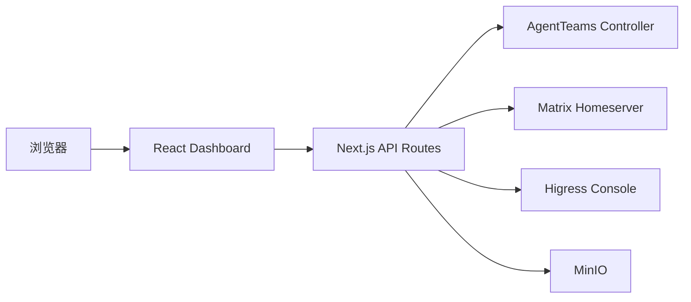

# AgentTeams Dashboard 架构

## 概述

AgentTeams Dashboard 是用于管理 AgentTeams 集群资源的 Next.js Web 控制台。它管理 Worker、Team、Human、Manager、基础设施状态与 Matrix 聊天，并通过服务端路由代理访问外部系统。

浏览器调用 Dashboard 自身的 API；Next.js 路由再访问 AgentTeams Controller、Matrix Homeserver、Higress Console 或对象存储。该边界将认证令牌、会话 Cookie、超时和目标地址校验保留在服务端。

## 技术栈

- Next.js 16、React 19、TypeScript 5
- Tailwind CSS 4 和 shadcn/ui
- TanStack Query 与 Zustand
- Vitest 和 Testing Library
- AgentTeams Controller、Matrix、Higress Console、MinIO 为可选外部依赖

## 结构

```text
src/
  app/                 Next.js 页面、布局和 API 路由
  components/          Dashboard、认证、设置与 UI 组件
  hooks/               TanStack Query 数据读取与 mutation 封装
  lib/                 API 客户端、代理认证、状态与纯工具
install/               独立安装脚本与 AgentTeams 集成补丁
```

## 子系统

### Dashboard UI

位置：`src/components/dashboard/`

负责导航、资源管理界面、基础设施状态和模型管理。各 section 通过 hooks 获取数据。

### AgentTeams 代理

位置：`src/app/api/agentteams/`、`src/lib/agentteams-api.ts`

负责将 Dashboard 请求转发到 Controller，处理授权令牌、超时和错误响应。

### Matrix 代理

位置：`src/app/api/matrix/`、`src/lib/matrix-api.ts`

负责 Matrix 登录、房间、消息与同步请求。代理层实施 homeserver 允许列表。

### Higress 集成

位置：`src/app/api/higress/`、`src/lib/higress-api.ts`

负责 Higress Console 的 Provider 与 AI Route 管理。Provider 响应在返回浏览器前移除 Token 值。

### 部署集成

位置：`install/`

负责 Dashboard 容器启动和与 AgentTeams 安装器的补丁集成。`install/AGENTTEAMS_PATCH.md` 记录外部 AgentTeams 源码绑定。



## Higress 外部适配

外部模式使用 Gateway 数据平面地址供 Manager 与 Worker 发起模型请求，使用可选 Console 地址供 Dashboard 管理 Provider 与 AI Route。两个地址是不同配置项；当前适配规格位于 `.monkeycode/specs/higress-ai-gateway/`。
