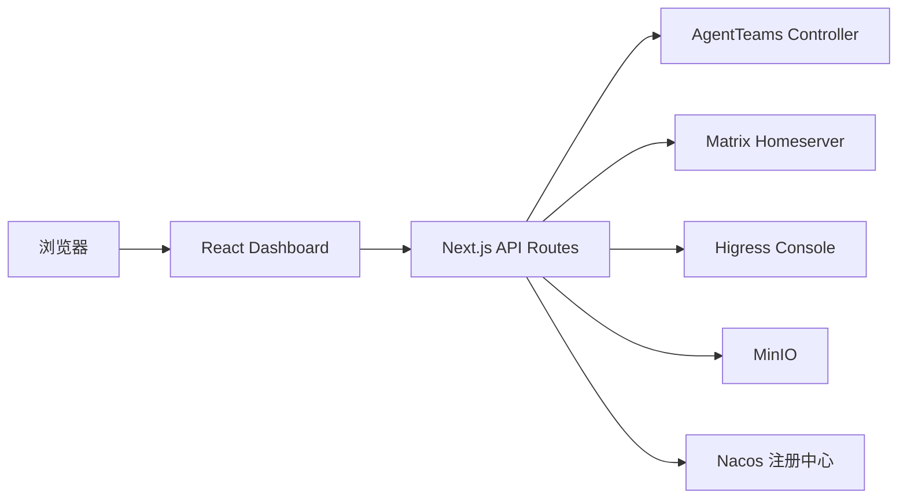

# AgentTeams Dashboard 架构

## 概述

AgentTeams Dashboard 是用于管理 AgentTeams 集群资源的 Next.js Web 控制台。它管理 Worker、Team、Human、Manager、技能中心、基础设施状态与 Matrix 聊天，并通过服务端路由代理访问外部系统。

浏览器调用 Dashboard 自身的 API；Next.js 路由再访问 AgentTeams Controller、Matrix Homeserver、Higress Console、Nacos 注册中心或 MinIO 对象存储。该边界将认证令牌、会话 Cookie、超时和目标地址校验保留在服务端。

技能中心支持三种来源的技能管理：用户自定义上传（`custom`）、从 Nacos 注册中心同步（`nacos`）和内置全局技能（`builtin`）。Nacos 来源的技能在 Worker 创建时自动从注册中心拉取内容并安装。

## 技术栈

- Next.js 16、React 19、TypeScript 5
- Tailwind CSS 4 和 shadcn/ui
- TanStack Query 与 Zustand
- Vitest 和 Testing Library
- AgentTeams Controller、Matrix、Higress Console、MinIO 为可选外部依赖

## 结构

```text
src/
  app/                 Next.js 页面、布局和 API 路由
    api/
      agentteams/
        skills/        技能 CRUD、上传下载与分发
          nacos/        Nacos 技能下载、配置管理与同步
  components/          Dashboard、认证、设置与 UI 组件
    dashboard/
      sections/
        skills/        技能中心页面组件
  hooks/               TanStack Query 数据读取与 mutation 封装
  lib/                 API 客户端、代理认证、状态与纯工具
    skill-center-*.ts  技能中心存储、配置与类型定义
install/               独立安装脚本与 AgentTeams 集成补丁
```

## 子系统

### Dashboard UI

位置：`src/components/dashboard/`

负责导航、资源管理界面、基础设施状态和模型管理。各 section 通过 hooks 获取数据。

Dashboard 导航由 `nav-items.ts` 集中定义，包含总览、智能体、AI 网关、平台和治理五个可折叠分组，以及常驻文档入口。`use-active-section.ts` 将当前节和展开分组持久化到 localStorage，并使用 `#group/section` 深链接格式；旧版扁平哈希会自动映射到对应分组。当前活动节所在分组保持展开，分组内子项支持上下方向键聚焦和 Enter 激活。

### AgentTeams 代理

位置：`src/app/api/agentteams/`、`src/lib/agentteams-api.ts`

负责将 Dashboard 请求转发到 Controller，处理授权令牌、超时和错误响应。

### Matrix 代理

位置：`src/app/api/matrix/`、`src/lib/matrix-api.ts`

负责 Matrix 登录、房间、消息与同步请求。代理层实施 homeserver 允许列表。

### Higress 集成

位置：`src/app/api/higress/`、`src/lib/higress-api.ts`

负责 Higress Console 的 Provider 与 AI Route 管理。Provider 响应在返回浏览器前移除 Token 值。

### A2UI 聊天渲染

位置：`src/components/dashboard/sections/chat/`、`src/lib/a2ui/parser.ts`

Matrix 消息正文与 formatted_body 由 `parseA2uiContent` 解析为 A2UI 协议消息、agent 消息 repr、legacy thinking/卡片块与纯文本。流式输出使用 `IncrementalA2uiRenderer`：只对新增消息（`messages.slice(startIndex)`）增量处理，避免对完整消息列表的全量重处理破坏处理器内部 surface 状态；流式且长时间无 surface 时用静态提示替换三点动画。`A2uiChatContent` 通过 `looksLikeStructuredStreaming` 同时检查正文与 formatted_body 中的 A2UI 标记、agent repr 与 legacy 块，保证思考与工具调用在流式中以可折叠卡片呈现。

### 技能中心

位置：`src/app/api/agentteams/skills/`、`src/lib/skill-center-*.ts`、`src/components/dashboard/sections/skills/`

负责技能的存储、上传、下载与分发。技能以 ZIP 包形式存储在 MinIO 的 `skills` bucket 中，元数据以 JSON 文件记录于 `skills/` 前缀下。支持三种来源：

- `custom`：用户通过 Dashboard 上传的自定义技能，可覆盖更新。
- `nacos`：从 Nacos 注册中心同步的技能元数据，内容在首次下载时自动从 Nacos 拉取并缓存到 MinIO。Nacos 技能不可覆盖（返回 403），需通过 Nacos 侧更新后重新同步。
- `builtin`：全局内置技能，从主 bucket 的 `agents/global/skills/` 前缀读取，仅可安装到 Worker。

技能分发流程：Worker 创建/编辑时指定技能名称列表，Dashboard 按名称逐一下载技能 ZIP 并通过 `POST /workers/{name}/skills` 推送到 Worker。通用技能下载 403 时自动降级到 Nacos 专用下载端点。

### Nacos 集成

位置：`src/app/api/agentteams/skills/nacos/`、`src/lib/skill-center-config.ts`

负责与 Nacos 注册中心的技能元数据同步。配置通过 `PUT /api/agentteams/skills/nacos/config` 管理，以 `nacos://host:port/namespace` 格式的 URL 标识注册中心。

支持两种同步模式：
- `services`：通过 Nacos 服务发现 API (`/v1/ns/catalog/services`) 列出服务，以服务元数据中的 `homePageUrl` 字段作为技能包下载地址。
- `skills`：通过 Nacos 3.2+ 技能 API (`/v3/console/ai/skills/detail`) 获取 base64 编码的 ZIP 内容。

同步流程 (`POST /skills/nacos/sync`)：从 Nacos 拉取技能列表，为每个技能写入元数据 JSON（不含实际文件内容），后续 Worker 安装时通过下载端点按需拉取实际文件并缓存在 MinIO 中。

### 部署集成

位置：`install/`

负责 Dashboard 容器启动和与 AgentTeams 安装器的补丁集成。`install/AGENTTEAMS_PATCH.md` 记录外部 AgentTeams 源码绑定。



## Higress 外部适配

外部模式使用 Gateway 数据平面地址供 Manager 与 Worker 发起模型请求，使用可选 Console 地址供 Dashboard 管理 Provider 与 AI Route。两个地址是不同配置项；当前适配规格位于 `.monkeycode/specs/higress-ai-gateway/`。
