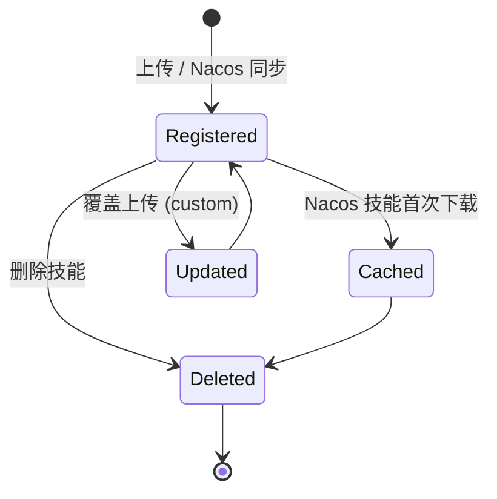
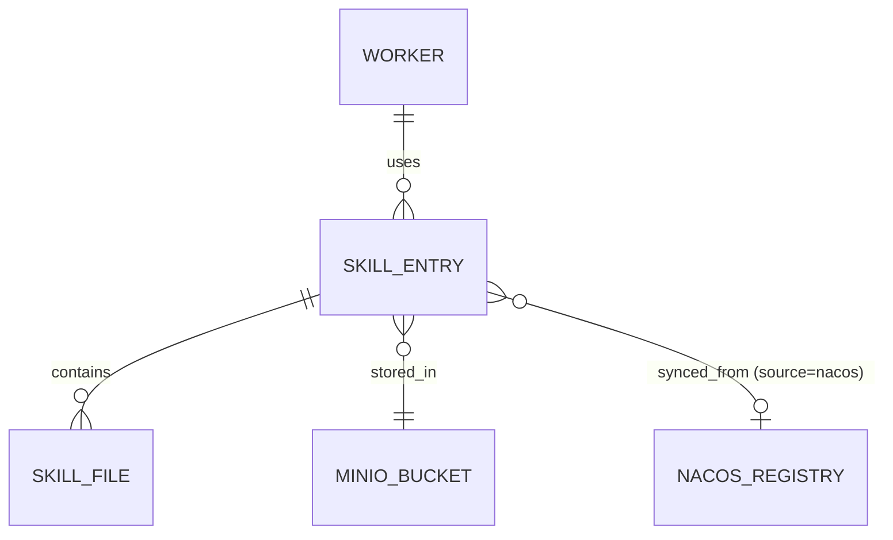

# 技能中心

技能中心是 AgentTeams Dashboard 的统一技能管理界面，支持从多种来源获取技能并将其分发到 Worker 实例。

## 什么是技能？

技能是 AgentTeams Worker 的可插拔能力模块，以 ZIP 包形式包含 `skill.md`（元数据）及其他资源文件。技能定义了 Worker 可执行的任务能力，例如代码生成、文档分析、API 调用等。

**关键特征**:
- 三种来源共存：自定义上传、Nacos 注册中心同步、内置全局技能
- 按名称唯一标识，同名技能元数据优先，全局技能同名被覆盖
- Nacos 来源技能元数据在 MinIO 存储，实际文件内容按需从注册中心拉取

## 代码位置

| 方面 | 位置 |
|------|------|
| 类型定义 | `src/lib/skill-center-types.ts` |
| 存储操作 | `src/lib/skill-center-storage.ts` |
| Nacos 配置 | `src/lib/skill-center-config.ts` |
| API 路由 (CRUD) | `src/app/api/agentteams/skills/route.ts` |
| API 路由 (Nacos) | `src/app/api/agentteams/skills/nacos/` |
| 前端组件 | `src/components/dashboard/sections/skills/` |
| 前端 hooks | `src/hooks/use-skill-center.ts`, `src/hooks/use-nacos-config.ts` |
| 测试 | `src/app/api/agentteams/skills/route.test.ts` |

## 结构

```typescript
interface SkillEntry {
  name: string;
  description: string;
  source: 'custom' | 'nacos' | 'builtin';
  sourceAlias?: string;        // 来源别名展示
  version?: string;
  createdAt: string;           // ISO 时间戳
  updatedAt: string;
  fileCount: number;           // ZIP 包内文件数量
}

interface NacosConfig {
  registryUrl: string;         // nacos://host:port/namespace 格式
  namespace: string;
  alias?: string;
  protocol?: 'http' | 'https'; // 默认 http
  apiPrefix?: string;          // 默认 /nacos
  mode?: 'services' | 'skills'; // 默认 services
  username?: string;
  password?: string;
  lastSyncAt?: string;
  lastSyncStatus?: 'success' | 'error';
  lastSyncError?: string;
}
```

### 关键字段

| 字段 | 类型 | 描述 | 约束 |
|------|------|------|------|
| `name` | `string` | 技能唯一标识 | 匹配 `SKILL_NAME_PATTERN`（字母数字、点、下划线、中划线） |
| `source` | `enum` | 技能来源 | `custom`、`nacos`、`builtin` 之一 |
| `fileCount` | `number` | 文件数量 | 上传时从 ZIP 解析得出 |
| `createdAt` | `string` | 创建时间 | 覆盖时保留原值 |
| `registryUrl` | `string` | Nacos 地址 | `nacos://host[:port]/namespace` 格式 |

## 不变量

1. **Nacos 技能不可覆盖**：`source=nacos` 的技能在 `POST /skills` 指定 `overwrite=true` 时返回 403。更新需通过 Nacos 侧修改后重新同步。

2. **覆盖保留创建时间**：使用 `overwrite=true` 上传技能时，`createdAt` 保留原始值，仅更新 `updatedAt`。

3. **MinIO 缓存优先**：Nacos 技能下载先检查 MinIO 缓存，命中则直接返回；未命中才从 Nacos 拉取。

4. **技能文件上限**：单个技能包不超过 64 MB（`SKILL_PACKAGE_MAX_BYTES`）。

## 生命周期



### 状态描述

| 状态 | 描述 | 允许的转换 |
|------|------|-----------|
| `Registered` | 元数据已存储，内容可能未缓存（Nacos 技能） | -> Updated (覆盖), -> Deleted, -> Cached (首次下载) |
| `Cached` | Nacos 技能内容已在 MinIO 缓存 | -> Deleted |
| `Updated` | 自定义技能已覆盖更新 | -> Registered (完成更新) |
| `Deleted` | 技能已移除 | (终态) |

## 关系



| 关联概念 | 关系 | 描述 |
|---------|------|------|
| Worker | 使用 | Worker 可安装多个技能，技能可分发到多个 Worker |
| MinIO Bucket | 存储于 | 所有技能文件和元数据存储在 MinIO `skills` bucket |
| Nacos Registry | 同步自 | `source=nacos` 的技能元数据来自 Nacos 注册中心 |
