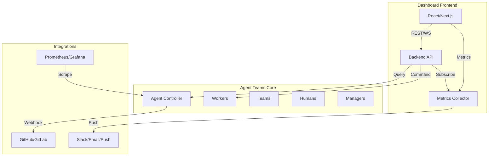

# AgentTeams 未来改进方向设计方案

Feature Name: agentteams-future-improvements  
Updated: 2026-07-31  

## 1. 概述

本设计方案系统分析了 AgentTeams Dashboard 当前的功能缺口，提出了 8 个维度共计 **42 项** 具体改进建议，并按优先级排序出 TOP 5 推荐实施项。目标是构建一个生产就绪、可扩展、易用的 AI Agent 运维平台。

## 2. 设计原则

| 原则 | 说明 |
|------|------|
| **可观测性优先** | 先有度量，才有优化；全链路指标采集是基础 |
| **渐进式增强** | 核心能力（告警/监控）先实现，扩展特性（编排/自动化）后迭代 |
| **向后兼容** | 所有新 API 需保持与现有 `/api/agentteams/*` 接口兼容 |
| **用户可控** | 自动化行为（如修复引擎、通知策略）必须可配置、可审计 |
| **安全第一** | 任何涉及资源变更的操作均需权限验证和操作确认 |

## 3. 架构总览



## 4. 分项设计方案

### 4.1 性能监控指标可视化（High Priority）

#### 4.1.1 目标
为每个 Worker/Team 提供 CPU/Memory/Network 的实时指标展示和历史趋势分析。

#### 4.1.2 架构设计
- **数据采集层**：在 Agent Controller 中新增 `/metrics` 端点，每 5 秒暴露 Prometheus 格式指标（worker_cpu_usage、worker_memory_bytes、worker_network_rx_bytes 等）
- **存储层**：可选集成 Prometheus；内置 fallback 方案：每次查询时聚合过去 N 条日志记录（简单方案）
- **API 层**：新增 `/api/agents/{name}/metrics?start=...&end=...&interval=...` 返回时间序列数据
- **UI 层**：
  - Worker 详情页添加 "Resource Usage" 标签页，包含 CPU/Network 折线图（Recharts）
  - Overview 页面增加全局资源利用率 KPI 卡片
  - Worker Table 新增排序列（CPU% / Memory%）

#### 4.1.3 数据类型
```typescript
export interface MetricPoint {
  timestamp: string; // ISO 8601
  cpu: number;     // percentage (0-100)
  memory: number;  // bytes
  networkRx: number; // bytes
  networkTx: number; // bytes
}

export interface MetricResponse {
  entity: 'worker' | 'team';
  name: string;
  data: MetricPoint[];
}
```

#### 4.1.4 正确性属性
- 每个实体每分钟最多产生 1 个 metric point（granularity 可配置）
- 历史数据保留默认 7 天（可配置）
- 指标值需在 [0, 100]%（CPU）和 [0, ∞]（字节）范围内

#### 4.1.5 错误处理
- Metrics API 不可用时降级显示 "无可用数据"
- 采集失败不阻塞主流程，仅记录到 error boundary

#### 4.1.6 测试策略
- 单元测试：metric 聚合函数边界值（空数组、极端值）
- E2E 测试：模拟 metrics endpoint 响应，验证图表渲染
- 性能测试：100+ Worker 页面加载时间 < 3s

---

### 4.2 告警系统集成（High Priority）

#### 4.2.1 目标
将 insights-engine 发现的问题通过外部渠道（Slack/Email/Matrix）通知相关责任人。

#### 4.2.2 架构设计
```
insights-engine → AlertManager → NotificationAdapter → [Slack/Email/Push]
                     ↑
               Configurable Rules (threshold, channels)
```

- **AlertManager**：接收 insights，去重、分级、分组
- **NotificationAdapter**：插件式接口，每个 channel 实现一个 adapter
- **Config Store**：保存用户配置的告警规则（via `/api/settings/alerts`）

#### 4.2.3 核心类型
```typescript
export type AlertSeverity = 'info' | 'warning' | 'critical';

export interface AlertRule {
  insightType: string; // e.g., 'low-worker-health', 'container-issues'
  severity: AlertSeverity;
  thresholds?: Record<string, number>; // custom thresholds per rule
  channels: ['matrix'] | ['slack'] | ['email'] | string[]; // multi-channel allowed
  recipients: string[]; // user IDs or webhook URLs
  throttleMinutes?: number; // minimum time between repeated alerts
}

interface NotificationPayload {
  title: string;
  body: string;
  severity: AlertSeverity;
  url: string; // deep link to dashboard
}
```

#### 4.2.4 Slack Adapter 实现概要
```typescript
class SlackAdapter implements NotificationAdapter {
  async send(payload: NotificationPayload, config: { webhookUrl: string }) {
    const color = payload.severity === 'critical' ? 'danger' : 
                  payload.severity === 'warning' ? 'warning' : 'good';
    await fetch(config.webhookUrl, {
      method: 'POST',
      body: JSON.stringify({
        attachments: [{ color, title: payload.title, text: payload.body, ts: Date.now()/1000 }]
      })
    });
  }
}
```

#### 4.2.5 正确性属性
- 每个告警规则至少关联一个有效 channel
- 相同告警在 throttleMinutes 内最多发送一次
- Critical 级别告警必须有至少一条通知渠道

#### 4.2.6 错误处理
- 通知发送失败自动重试（最多 3 次，退避 1s/2s/4s）
- 所有失败通知记录到 `alert-failures` 表，供人工排查

---

### 4.3 批量操作编排与进度跟踪（Medium Priority）

#### 4.3.1 目标
支持跨实体的批量操作编排，提供可视化进度和干跑预览。

#### 4.3.2 界面设计
- **Batch Operations Hub** 新增页面（路径 `/batch-operations`）
- 拖拽式工作流编辑器：拖入节点（Select Workers → Validate Phase → Action → Notify）
- Dry-run 模式：高亮显示将被影响的实体，不实际执行
- Execution Log：实时显示每个步骤的执行结果和错误

#### 4.3.3 数据结构
```typescript
export interface BatchStep {
  type: 'select' | 'validate' | 'action' | 'notify';
  config: any; // step-specific config
  order: number;
}

export interface BatchWorkflow {
  id: string;
  name: string;
  steps: BatchStep[];
  schedule?: { cron: string }; // optional scheduled execution
}
```

#### 4.3.4 正确性属性
- 所有步骤按 order 顺序串行执行
- Validate 步骤失败时终止后续步骤并回滚已完成部分（如有 undo）
- Select 步骤返回的实体集合在后续步骤中保持不变（snapshot）

---

### 4.4 新手引导与帮助体系（Medium Priority）

#### 4.4.1 目标
降低新用户的学习成本，减少误操作。

#### 4.4.2 实施方案
- **首次启动引导**：使用 `react-joyride` 或定制的高亮 overlay，逐步介绍核心区域（左侧导航、顶部搜索、Worker 表格）
- **上下文帮助按钮 (?)**：在每个 SectionHeader 右侧添加帮助图标，点击弹出该页面的操作提示（如 "此处可查看 Worker 健康状态"）
- **快捷键提示**：Command Palette 左下角永久显示 "⌘ / Ctrl + K"，并支持在设置中自定义
- **交互式教程**：提供一个 Sandbox 模式，让用户在不影响真实集群的情况下练习操作

#### 4.4.3 数据存储
用户引导状态存储在 `localStorage`（key: `agentteams-tour-step`），已完成步骤不再重复显示。

---

### 4.5 OAuth/SSO 登录支持（Medium Priority）

#### 4.5.1 目标
提供更友好的身份认证方式，替代单一的 Matrix 密码登录。

#### 4.5.2 架构
```
┌─────────────┐       ┌──────────────┐       ┌─────────────┐
│  Dashboard  │──────▶│  Auth Gateway│──────▶│  GitHub/    │
│  (Next.js)  │ OAuth2 │ (Next.js API  │   Google/OIDC │
│             │◀─────┤    Server)     │   providers │
└─────────────┘       └──────────────┘       └─────────────┘
```

- Auth Gateway：处理 OAuth 回调，生成内部 session cookie
- Existing Matrix auth 作为 fallback 保留
- Store 更新：useMatrixStore 合并 useAuthStore，统一获取当前 user info

#### 4.5.3 新增类型
```typescript
export interface OAuthProvider {
  id: 'github' | 'google' | 'gitlab';
  name: string;
  icon: React.ReactNode;
}

export interface UserInfo {
  userId: string;
  displayName: string;
  email?: string;
  avatarUrl?: string;
  authMethod: 'matrix' | 'oauth';
}
```

---

## 5. 实施路线图

### Phase 1（第 1-2 周）：核心可观测性
- [ ] 实现 Prometheus Metrics 采集端点
- [ ] 创建 Metrics API 层 (`/api/agents/{name}/metrics`)
- [ ] 开发 Recharts 折线图片段嵌入 Worker 详情
- [ ] Overview 页面添加资源利用率 KPI 卡片

### Phase 2（第 3-4 周）：告警触达
- [ ] 设计 AlertRule 配置 schema 及 settings API
- [ ] 实现 Slack/Email notification adapters
- [ ] 连接 insights-engine 输出到 alert manager
- [ ] UI 添加告警规则管理页面（阈值、渠道选择）

### Phase 3（第 5-7 周）：批量编排
- [ ] 开发 Batch Operations Hub 页面骨架
- [ ] 实现拖拽式工作流编辑器（React DnD）
- [ ] 串联 select-validate-action 三步流程
- [ ] 添加 dry-run 预览和进度条

### Phase 4（第 8-9 周）：体验提升
- [ ] 集成新手引导库并编写 3-5 个 step 描述
- [ ] 在各页面添加上下文帮助 (?) 按钮
- [ ] 实现 Command Palette 快捷键提示
- [ ] 补充 EmptyState 组件库（Teams/Workers/Managers 空列表）

### Phase 5（第 10 周）：身份整合
- [ ] 搭建 OAuth 服务器端回调处理
- [ ] 添加 GitHub/Google 登录按钮到 Login Page
- [ ] 实现 Session 迁移（旧 Matrix session 与新 OAuth session 关联）
- [ ] 统一 UI 登录入口（切换 auth 方式）

## 6. 风险评估与应对

| 风险 | 概率 | 影响 | 缓解措施 |
|------|------|------|----------|
| Metrics 采集对 Agent 性能有额外负载 | 中 | 高 | 使用 prometheus/client 默认 low-cardinality 指标；采样率可调 |
| 通知渠道配置复杂导致用户不使用 | 低 | 中 | 预设 "Critical 仅 Matrix" 默认规则；逐步引导开通 |
| 工作流编辑器开发周期超预期 | 中 | 高 | MVP 版本仅支持线性序列（无分支），后期再增加条件逻辑 |
| OAuth 回调 URL 配置繁琐（企业用户） | 低 | 中 | 提供 Docker 环境变量一键配置；自动生成 redirect URI 模板 |

## 7. 验收标准

完成以下所有条件视为本项目交付：
1. ✅ Worker 详情页展示 CPU/Memory 折线图（过去 1 小时）
2. ✅ Insight 触发时能通过 Slack/Matrix 发送告警通知（可配置）
3. ✅ 批量操作支持 Select-Wake-EnsureReady 三步编排，有进度反馈
4. ✅ 首次访问显示 3 步引导弹窗（Navigation → Search → Worker Card）
5. ✅ Login Page 提供 "Continue with GitHub" 按钮，认证成功后跳转 Dashboard
6. ✅ 所有新增代码覆盖单元测试，整体类型检查无 error，lint 无 new errors

## 8. 参考文档

[^1]: `src/lib/insights-engine.ts` - 现有洞察检测逻辑，告警规则的数据源  
[^2]: `src/components/dashboard/sections/workers/worker-selectors.ts` - Worker 聚合工具函数，监控数据的预处理依赖  
[^3]: `src/components/dashboard/sections/chat/chat-composer.tsx` - Slash Command 实现模式，可用于告警命令集成  
[^4]: `src/components/dashboard/command-palette.tsx` - 全局搜索命令面板，新手引导可复用其 UI 风格  
[^5]: `.monkeycode/specs/matrix-chat-experience/design.md` - 已有 Matrix 聊天优化设计，保持一致性风格

---

*由 MonkeyCode AI Agent 自动生成 | 基于静态代码分析报告 `/tmp/improvement_analysis.md`*
