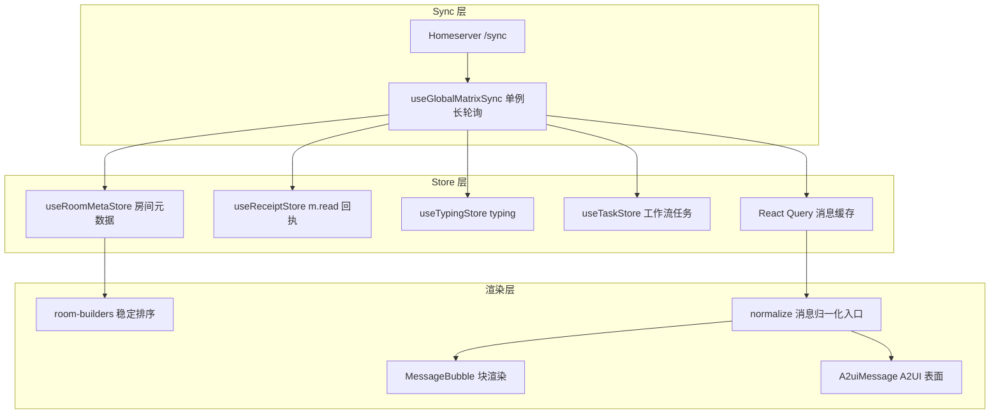

# 聊天未读状态、列表排序与运行时渲染优化设计

Feature Name: chat-unread-sort-rendering
Updated: 2026-08-11

## 描述

优化 AgentTeams Dashboard 聊天模块三条链路：

1. **未读/已读**：补齐 `m.read` 公开回执发送链路，与既有 `m.fully_read` 私有标记形成双写；进入房间时恢复阅读位置（未读分割线定位）。
2. **列表排序**：会话列表改为按最新消息时间戳稳定排序，消除"每次同步列表重排"的抖动。
3. **运行时渲染**：建立统一的消息归一化渲染管线，覆盖 openclaw、qwenpaw、copaw、hermes 四种运行时的消息形态，支持 `m.replace` 编辑式流式的中间态渲染、工具调用卡片、思考卡片和 A2UI 协议渲染。

## 范围决策（已与需求方确认）

| 决策点 | 结论 |
|---|---|
| 改动范围 | 仅 Dashboard 前端仓库，不修改上游 agentscope-ai/AgentTeams |
| 流式形态 | 渲染 `m.replace` 编辑事件的中间态（分块刷新），与上游运行时的编辑式流式对齐 |
| 验收方式 | 自动化测试（vitest 单测 + 组件测试）+ 真实 AgentTeams 集群手工验收 |

## 现状审查

以下结论均来自对本仓库代码的实际阅读，标注了文件位置。

### 已实现的能力

| 能力 | 位置 |
|---|---|
| 房间未读角标（`unread_notifications` → 红点） | `src/hooks/use-matrix.ts:85-174`（RoomMetaStore）、`room-list-item.tsx:102-120` |
| 未读乐观清除 + 30 秒宽限期抑制服务端旧计数 | `use-matrix.ts:107-166`（`UNREAD_GRACE_MS`） |
| `m.fully_read` 读写 API 代理 | `src/app/api/matrix/rooms/[roomId]/read-marker/route.ts` |
| 进入房间/滚到底部时上传 `m.fully_read` | `ChatRoom.tsx:167-182`（`markAllRead`）、`407-417` |
| 未读分割线组件（锚定 `m.fully_read` 事件） | `components/ReadMarker.tsx`、`structures/TimelinePanel.tsx:31-53` |
| 自己消息的 ✓/✓✓（他人 `m.read` 回执） | `use-matrix.ts:193-202`（`isMessageReadByOthers`）、`MessageBubble.tsx:337-343` |
| 会话排序（未读优先 → @提醒优先 → 时间倒序 → 名称） | `room-builders.ts:102-117`（`sortRoomsByRecency`） |
| `m.replace` 编辑合并（流式占位刷新） | `use-matrix.ts:818-897`（`formatMatrixEvents`）、`610-654`（`mergeTimelineEvents`） |
| A2UI v0.9 渲染（HTML 注释 / fence 两种嵌入） | `src/lib/a2ui/parser.ts`、`a2ui-message.tsx`、`catalog.tsx`（6 个自定义组件 + basicCatalog） |
| copaw agentscope repr 文本解析 | `src/lib/a2ui/agent-repr.ts`（396 行完整 repr parser） |
| 思考卡片 / 工具卡片 / 工作流卡片 / 确认卡片 | `thinking-card.tsx`、`views/toolcalls/`、`views/workflow-card.tsx`、`confirmation-card.tsx` |
| hermes 主答案 thread 内联（同 sender 启发式） | `use-matrix.ts:863-876` |
| typing 指示与回执长轮询 | `use-matrix.ts:473-601`（`useTypingSync`） |

### 确认的缺口（问题清单）

**G1. 同步循环碎片化，房间元数据更新时机错误**
`useTypingSync(roomId)` 仅在 `ChatRoom` 挂载时运行（`ChatRoom.tsx:84`），即只有选中房间后 `/sync` 才开始。首次进入聊天页（`selectedRoomId = null`）没有任何同步，房间列表无时间戳、无未读角标。且 `roomId` 在该 hook 的 `useEffect` 依赖数组中（`use-matrix.ts:600`），每次切换房间都重启同步并丢弃 `syncToken`（`use-matrix.ts:485`），触发全量 initial sync，元数据分批到达导致列表反复重排——这是"每次同步都乱了"的直接成因。另外 `useTaskSync`（`use-task-sync.ts:27`，挂载于 `agent-teams-dashboard.tsx:86`）是第二个独立 `/sync` 循环，两个循环并存造成双倍长轮询开销。

**G2. 排序键包含未读状态，点击即抖动**
`sortRoomsByRecency` 把"有未读"作为第一排序键（`room-builders.ts:103-110`）。用户点击未读房间 → `clearUnread` 立即清零（`room-list-item.tsx:57-62`）→ 房间立刻从顶部未读区掉落，列表在用户眼前重排。

**G3. 只写 `m.fully_read`，不发 `m.read` 回执**
现有 `setReadMarker` 只写私有账户数据（`matrix-api.ts:243-260`），`src/app/api/matrix/rooms/[roomId]/` 下无 receipt 路由。`m.fully_read` 不会清零 homeserver 的 `unread_notifications`（代码注释已记录该现象：`use-matrix.ts:90-96`），当前靠 30 秒宽限期硬编码兜底；同时其他成员看不到当前用户的已读位置。上游运行时的做法是双写（见"上游参考事实"F1）。

**G4. 进入房间立即推进阅读位置，未读分割线闪退**
`ChatRoom.tsx:213-219` 在首屏数据到达时无条件 `markAllRead()`，`m.fully_read` 立刻被推到最新消息，分割线锚点消失（`TimelinePanel` 把分割线插在锚点之后，锚点即最后一条时不可见）。没有"定位到第一条未读"的阅读位置恢复。

**G5. 渲染分派逻辑散落且各自为政**
- `MessageBubble.tsx:131-134` 调 `parseA2uiContent`；`markdown-message.tsx:67-99` 又内置一份 legacy ```card / `<details class="thinking">` 解析（`parseCustomBlocks`），与 `parser.ts:266-340` 逻辑重复。
- qwenpaw 思考消息的正文形态 `"Thinking:\n\n..."`（上游 `on_streaming_end` 产物）前端没有专门识别，只能按普通文本渲染。
- `com.agentteams.long_message` 长消息元数据与 `com.agentteams.attachment` 附件关联（上游 channel.py:93,100）前端完全未消费（全仓库 grep 零匹配），超过 64KB 的回复在 Dashboard 只显示被截断的正文。
- `parser.ts:407-501` 的 `legacyToA2uiMessages` / `thinkingToA2uiMessages` 导出后无任何调用点（死代码）。

**G6. 流式中间态渲染不完整**
`m.replace` 合并在数据层已实现，但 `MarkdownMessage` 没有流式输入（`markdown-message.tsx` 全文无 `isStreaming`），普通文本在流式期间每帧都走完整 ReactMarkdown 渲染（GFM + KaTeX + highlight），无轻量路径、无流式光标。既有 spec `matrix-chat-experience` 需求 2 定义了该行为但未落地。A2UI 解析对未闭合 fence 无容错：`JSON.parse` 失败即降级为文本（`parser.ts:168-171`），流式期间 A2UI 块会在"原始文本 ↔ 渲染表面"之间闪烁。

**G7. 运行时识别无统一入口**
copaw 靠 repr 正则、hermes 靠 thread 同 sender 启发式、qwenpaw/openclaw 靠 `org.agentteams.*` content key，新增一种消息形态需要改多处。注：`org.agentteams.run` 结构化块（`parser.ts:56-77`）是前端自定义的 opt-in 通道，上游目前没有任何生产者（上游结构化通道为 `agentteams.workflow`、`com.agentteams.long_message` 等，见下节）。

## 上游参考事实

以下来自对 `github.com/agentscope-ai/AgentTeams` main 分支（HEAD `45eb463`）的实际代码阅读，克隆于 `/tmp/opencode/agentteams-ref`。

- **F1 已读双写**：`plugins/agentteams-matrix-channel/agentteams_matrix/channel.py:2980` `_send_read_receipt` 调 `room_read_markers(room_id, fully_read_event=event_id, read_event=event_id)`，`m.fully_read` 与 `m.read` 同时上报；bot 在消费入站消息后立即调用（同文件 2280/2718/2857 行调用点）。同样实现存在于 `copaw/src/matrix/channel.py:2209`。
- **F2 编辑式流式（qwenpaw）**：`on_streaming_start` 确保 thread root（占位 `m.notice` "处理中..."，`channel.py:3478` `_ensure_thread_root`）；`on_streaming_delta` 直接 return 丢弃全部中间帧（`channel.py:4108-4110`）；`on_streaming_end` 将思考文本包装为 `"Thinking:\n\n" + text` 以 `m.notice` 发入 thread（`channel.py:4129-4143`）；运行结束用 `m.replace` 把占位消息编辑为最终答案（`channel.py:3550` `_edit_matrix_event`，`m.mentions` 按 MSC3952 双写）。
- **F3 工具调用路由**：`_TOOL_CALL_MESSAGE_TYPE_NAMES = {FUNCTION_CALL, PLUGIN_CALL, MCP_TOOL_CALL}`，`_TOOL_OUTPUT_MESSAGE_TYPE_NAMES = {FUNCTION_CALL_OUTPUT, PLUGIN_CALL_OUTPUT, MCP_TOOL_CALL_OUTPUT}`（`channel.py:151-156`）；工具调用/输出与 REASONING 完成事件发入 thread（`channel.py:4034-4083`）；工具执行中的流式进度（`ContentType.DATA` + `RunStatus.InProgress`）被静默丢弃（`channel.py:4013-4032`）。展示开关：`show_thinking` / `show_tool_calls` / `show_tool_results`（`plugin.py:19-21`）。
- **F4 copaw 无流式钩子**：`copaw/src/matrix/channel.py` 无 `on_streaming_*` 实现，只有完成事件路由；其消息 schema 来自 `agentscope_runtime.engine.schemas.agent_schemas`。
- **F5 hermes**：基于上游 mautrix adapter 子类化（`hermes/src/hermes_matrix/overlay_adapter.py`），传输能力（流式编辑、typing、回执、线程）全部由上游 adapter 提供；桥接层暴露 `MATRIX_FILTER_TOOL_MESSAGES` / `MATRIX_FILTER_THINKING` 等 env（`hermes_worker/bridge.py`）。
- **F6 openclaw（Manager）**：`manager/configs/manager-openclaw.json.tmpl` 中 `channels.matrix` 配置 `"streaming": "partial"`、`"blockStreaming": true`，即 Manager 侧以分块编辑形式流式。
- **F7 长消息回退**：单事件超 64KB 安全阈值时全文上传为 Matrix 附件，正文截断并携带 `com.agentteams.long_message` 元数据 `{version, url: mxc://..., filename, mimetype}`（`channel.py:93,3844`）；附件与父事件通过自定义 relation `com.agentteams.attachment` 关联（`channel.py:100`）。
- **F8 工作流消息**：`plugins/workerflow/mcp/server.py:748-780` 对同一事件反复 `m.replace` 刷新工作流状态，结构化数据在 `agentteams.workflow` content key（`type/runId/status/title/summary/ownerRole/ownerAgentId/coordinator/sharedPath/subagents/steps`）。
- **F9 上游无 A2UI**：全仓库无 `a2ui` 匹配；A2UI 渲染是 Dashboard 自有能力，上游不产生 A2UI 消息。上游无会话列表 UI 与未读计数实现（由 Element 客户端承担），本设计的排序/未读方案无上游代码可参照，参照的是 Matrix 协议语义与上游 bot 侧回执行为。

## 架构



核心变化：

1. `useTypingSync` 与 `useTaskSync` 合并为 `useGlobalMatrixSync`，挂载于 dashboard 级组件，登录期间常驻；房间切换不再重启同步。
2. 排序键从"未读优先 + 时间"改为"时间优先"，未读仅作角标与样式，消除点击抖动。
3. 已读上报从单写 `m.fully_read` 改为 `m.read` + `m.fully_read` 双写，新增 receipt 代理路由。
4. 渲染分派收敛为 `normalize` 单一入口，`MessageBubble` 与 `MarkdownMessage` 共用，删除重复与死代码。

## 组件和接口

### 3.1 全局同步循环 `useGlobalMatrixSync`（新）

文件：`src/hooks/use-global-matrix-sync.ts`（新）；挂载点改为 `src/components/dashboard/agent-teams-dashboard.tsx`（替换现有 `useTaskSync()` 调用）；`ChatRoom.tsx:84` 的 `useTypingSync(roomId)` 调用删除。

职责（合并自 `use-matrix.ts:473-601` 与 `use-task-sync.ts`）：

- 登录后启动 `/sync` 长轮询（timeout 25s，间隔 1s），持有 `syncToken` 全生命周期不随房间切换重置；复用 `syncGeneration` 失效机制（`matrix-store.ts:100-108`）处理登出/重登。
- 构造 sync filter（代理路由已支持 `filter` 参数，`api/matrix/sync/route.ts:14,18`）：`presence` 置空、`account_data` 仅 `m.fully_read`、`room.ephemeral` 仅 `m.typing` 与 `m.receipt`、timeline 开启 `lazy_load_members`，降低全量 initial sync 载荷。
- 对每个 `rooms.join` 条目分发：
  - `ephemeral`：`m.typing` → `useTypingStore`；`m.receipt` → `useReceiptStore`（现有逻辑原样迁移）。
  - `timeline`：`agentteams.workflow` 提取 → `useTaskStore`（现有逻辑迁移，保留 `markEventSeen` 去重）；`lastMessageTs`/`unread_notifications` → `useRoomMetaStore`（现有逻辑迁移）；仅当房间等于当前选中房间时执行 `mergeTimelineEvents` 写消息缓存。
- 保留 `useTaskSync` 首跑历史回补（`loadHistorical`，`use-task-sync.ts:76-98`），迁入全局循环启动路径。
- 选中房间来源：从 `useRoomMetaStore` 派生一个 `activeRoomId` 字段（`ChatSection` 在选择房间时写入），全局循环据此决定是否合并消息缓存。

接口：

```ts
export function useGlobalMatrixSync(): void;
// useRoomMetaStore 扩展
interface RoomMetaStore {
  activeRoomId: string | null;
  setActiveRoomId: (_roomId: string | null) => void;
  // meta/setRoomMeta/clearUnread/forgetRoom 保持现状
}
```

### 3.2 稳定排序 `sortRoomsByRecency` 改造

文件：`src/components/dashboard/sections/chat/room-builders.ts`。

- 排序键改为：`lastMessageTs` 降序 → 无时间戳排尾 → `name` 字典序。删除未读优先与 @提醒优先两个前置键。
- 未读呈现保持现状（红点角标），@提醒房间加样式加亮（如名称加粗/红点放大），不参与位置计算。
- `setRoomMeta` 已有不变即跳过的去重（`use-matrix.ts:125-131`），保证无变化时不触发重渲染；sync 每批次一次 `setRoomMeta` 调用 → 每周期至多一次列表重排，且仅在时间戳实际变化时发生。

### 3.3 已读双写

新增代理路由 `src/app/api/matrix/rooms/[roomId]/receipt/route.ts`：

- `POST /api/matrix/rooms/{roomId}/receipt?homeserver=...` → `POST /_matrix/client/v3/rooms/{roomId}/receipt/m.read/{eventId}`，请求体 `{}`，鉴权复用 `proxy-helper`。

`src/lib/matrix-api.ts` 新增：

```ts
sendReadReceipt: (homeserver: string, accessToken: string, roomId: string, eventId: string) => Promise<void>
```

`ChatRoom.tsx` 的 `markAllRead`（167-182 行）改为并行执行 `sendReadReceipt` 与 `setReadMarker`，保留乐观 `clearUnread` 与 `UNREAD_GRACE_MS` 兜底（homeserver 清零计数存在延迟或口径差异时仍抑制旧计数，与上游 F1 双写语义对齐）。

### 3.4 未读分割线与阅读位置恢复

文件：`ChatRoom.tsx`、`structures/TimelinePanel.tsx`。

- 删除首屏到达即 `markAllRead()` 的路径（`ChatRoom.tsx:213-219` 中 `markAllRead` 调用），初始滚动目标改为：若 `readEventId` 落后于最新消息 → 滚动到分割线；否则滚到底。
- `ScrollPanel` 增加 `scrollToItem(key)` 句柄方法（基于 react-virtuoso 的 `scrollToIndex`），用于定位分割线。
- 分割线 label 附带未读条数：`formattedMessages` 中时间戳晚于锚点事件的消息数（本地计算，口径与服务端 `notification_count` 解耦）。
- `markAllRead` 触发点收敛为两个：`onAtBottomChange(true)`（现有 `ChatRoom.tsx:407-417`）与本房间发送消息成功后。

### 3.5 消息归一化入口 `normalize`

文件：`src/lib/a2ui/normalize.ts`（新），`parser.ts` 的各解析函数作为其子步骤被复用。

```ts
export interface NormalizeInput {
  body: string;
  formattedBody?: string;
  content: Record<string, unknown>; // 原始 event.content
  isStreaming: boolean;
}
export function normalizeToBlocks(input: NormalizeInput): ParsedA2uiBlock[];
```

分派优先级（命中即返回，单一映射）：

1. `content['agentteams.workflow']` → `workflow` 块（现有）。
2. `content['org.agentteams.run']` → 结构化块（现有 `parseAgentRunBlocks`，保留为 opt-in 通道；文档注明上游暂无生产者）。
3. A2UI 标记（`<!--a2ui:...-->` / ```` ```a2ui ````）→ `a2ui` 块（现有）；流式容错见 3.6。
4. Tool Guard 确认文本正则 → `confirmation` 块（现有 `parseToolGuardConfirmation`）。
5. agentscope repr dump（`object='message' ...`）→ text/thinking/tool_call 块（现有 `agent-repr.ts`，覆盖 copaw）。
6. 正文以 `Thinking:` 前缀起始 → `thinking` 块（新增，精确匹配上游 F2 产物 `"Thinking:\n\n"` 前缀后剥离；覆盖 qwenpaw 思考消息）。
7. `content['com.agentteams.long_message']` → `attachment` 块（新增，覆盖上游 F7 长消息回退）。
8. legacy ```` ```card ```` / `<details class="thinking">` → card/tool_call/thinking 块（现有）。
9. 兜底 `text` 块（Markdown 渲染）。

`ParsedA2uiBlock['type']` 扩展 `'attachment'`，payload：`{ url: string; filename: string; mimetype: string }`。`mxc://` 转下载 URL 复用 `markdown-message.tsx:103-118` 的换算逻辑（提取为 `lib/matrix-media.ts` 共用）。

落点改造：

- `MessageBubble.tsx:131-134` 改为调用 `normalizeToBlocks`；`attachment` 块渲染为新组件 `AttachmentCard`（文件名、类型、下载链接、文本类型可展开预览，预览通过下载 URL 拉取，上限 256KB 截断）。
- `markdown-message.tsx` 的 `parseCustomBlocks`（67-99 行）删除，`MarkdownMessage` 退化为纯 text 块渲染器（thinking/card 已由归一化层在块级别处理，不再嵌套在 Markdown 内部二次解析）。
- 删除死代码 `legacyToA2uiMessages` / `thinkingToA2uiMessages`（`parser.ts:407-501`）及 `lib/a2ui/index.ts` 对应导出。
- hermes 的 thread 同 sender 内联（`use-matrix.ts:863-876`）保持现状，在代码注释中标注为 hermes 主答案兼容路径（上游 F5 的主答案以 thread reply 挂在自身占位消息下）。

### 3.6 流式中间态渲染

- `MarkdownMessage` 增加 `isStreaming?: boolean` 入参；`MessageBubble` 渲染 text 块时传入 `message.isStreaming`。
- 轻量路径：`isStreaming === true` 且正文不含块级特征（代码 fence、`#`、表格、列表、数学定界符）时，渲染 `<pre className="whitespace-pre-wrap">` + 尾部光标；含块级特征时直接完整 Markdown（接受重排，与既有 spec `matrix-chat-experience` 需求 2 一致）。流式结束回到完整 Markdown。
- A2UI 流式容错：`normalizeToBlocks` 在 `isStreaming` 且检测到未闭合 ```` ```a2ui ```` fence 或未闭合 `<!--a2ui:` 注释时，产出占位块（渲染加载态），而非把半成品 JSON 降级为文本；`isStreaming` 结束后正常解析。完整标记 JSON 解析失败仍降级为文本（需求 9.3）。
- A2UI 依赖升级（已核实 npm 与包内 CHANGELOG）：`@a2ui/web_core` 0.10.3 → 0.10.6、`@a2ui/react` 0.10.1 → 0.10.2。0.10.6 起 `MessageProcessor` 按 catalog schema 校验组件属性且校验失败会抛出异常（`message-processor.js` 校验分支），而 `a2ui-message.tsx:15` 目前在 `useMemo` 中裸调 `processMessages` 无 try/catch——升级必须配套在 `A2uiMessage` 增加异常兜底（失败时降级渲染原始文本块），否则一条畸形 A2UI 消息会使消息列表渲染崩溃。另注意本项目 catalog schema 为 zod v4 对象（`catalog.tsx:30-38` 的桥接注释），新版校验失败分支读取 zod v3 形状的 `error.errors`（zod v4 仅保留 `issues`，已在 zod 4.4.3 上实测确认），兜底须捕获任意异常类型而非特定错误类。升级收益：DataModel 原型链污染防护与组件属性校验（本项目渲染的是运行时产出的不可信消息，两项安全修复直接相关）、`v0.9.1` 消息版本前向兼容、RFC 6901 JSON Pointer 转义；无 breaking API 变化。
- 单批次多编辑取最新：`mergeTimelineEvents` 与 `formatMatrixEvents` 的 `m.replace` 合并已满足（每个 root 只保留最新内容），补测试固化。

### 3.7 各运行时消息形态对照表（实现依据）

| 运行时 | 最终答案 | 思考 | 工具调用/结果 | 流式形态 | 前端落点 |
|---|---|---|---|---|---|
| qwenpaw | `m.replace` 编辑占位消息 | `"Thinking:\n\n..."` m.notice 入 thread | 完成事件入 thread，进度静默 | 占位 + 编辑，无中间帧 | 规则 1/2/6 + thread 面板 |
| copaw | 完成事件直发；可能 dump repr | repr `type='reasoning'` | repr `function_call` 等 | 无（上游无流式钩子） | 规则 5（repr parser） |
| hermes | thread reply 挂在自身占位下 | 由 `MATRIX_FILTER_THINKING` 控制 | 由 `MATRIX_FILTER_TOOL_MESSAGES` 控制 | 上游 adapter 流式编辑 | 同 sender 内联（现有） |
| openclaw (Manager) | 分块编辑（`streaming: partial`） | 框架渲染器产物 | 框架渲染器产物 | `m.replace` 分块刷新 | 规则 3/7 + `m.replace` 合并 |

## 数据模型

复用现有模型，仅两处扩展：

```ts
// ParsedA2uiBlock 扩展（src/lib/a2ui/parser.ts）
type: 'a2ui' | 'thinking' | 'tool_call' | 'confirmation' | 'workflow' | 'card' | 'text' | 'attachment';
// attachment payload
{ url: string; filename: string; mimetype: string }

// RoomMetaStore 扩展（src/hooks/use-matrix.ts）
activeRoomId: string | null;
```

sync filter（作为 `/api/matrix/sync` 的 `filter` 查询参数 JSON）：

```json
{
  "presence": { "types": [] },
  "account_data": { "types": ["m.fully_read"] },
  "room": {
    "ephemeral": { "types": ["m.typing", "m.receipt"] },
    "timeline": { "lazy_load_members": true },
    "state": { "lazy_load_members": true }
  }
}
```

## 正确性约束

1. 同一时刻全局至多一个 `/sync` 循环；登出后循环终止且令牌不可复用。
2. 房间列表排序是纯函数：同一 `(rooms, roomMeta)` 输入必得同一顺序；`roomMeta` 未变化时不触发重渲染。
3. 点击房间清除未读角标不改变该房间的排序键。
4. `m.fully_read` 只在用户到达底部或发送消息时推进；进入房间本身不推进。
5. 一条 Matrix 消息经归一化入口映射为一种格式；解析失败一律降级为 text 块，渲染层不抛错。
6. `m.replace` 合并后每个根事件在渲染列表中至多出现一次，内容为最新编辑。
7. 既有 534 个测试全部保持通过。

## 错误处理

| 场景 | 策略 |
|---|---|
| `/sync` 失败 | 控制台记录，≤5s 退避重试（对齐 F1 层网络抖动语义） |
| `m.read` 回执发送失败 | 控制台警告，不影响界面（回执为尽力而为） |
| homeserver 不支持 `m.fully_read`（`M_BAD_JSON`） | 静默忽略（现有行为保留） |
| homeserver 未清零 `unread_notifications` | `UNREAD_GRACE_MS` 宽限期继续抑制（现有兜底保留） |
| A2UI JSON 解析失败 | 降级为 text 块渲染原始内容 |
| 长消息附件下载失败 | AttachmentCard 内联错误提示，不阻断时间线 |
| sync filter 被 homeserver 拒绝 | 首次请求不带 filter 重试一次并记录 |

## 测试策略

### 自动化测试（vitest，沿用现有框架与 jsdom 环境）

**单元测试**

| 目标 | 用例要点 |
|---|---|
| `sortRoomsByRecency` | 时间降序；同时间按名称；无时间戳排尾；清除未读不改变顺序；用 fast-check 生成随机元数据序列断言排序幂等（对同一输入重复排序结果一致） |
| `useGlobalMatrixSync` 分发 | 模拟 sync 响应：多房间元数据写入；`m.receipt` 解析进 ReceiptStore；workflow 事件去重入 TaskStore；仅选中房间合并消息缓存；登出后循环终止 |
| 已读双写 | `markAllRead` 同时调用 receipt 路由与 read-marker 路由；乐观 `clearUnread` 被调用；receipt 失败时 read-marker 仍执行 |
| `normalizeToBlocks` | 按运行时夹具覆盖九条分派规则：workflow key、A2UI 注释/fence、Tool Guard 文本、copaw repr（reasoning/function_call/output）、`Thinking:` 前缀剥离、`com.agentteams.long_message`、legacy card、纯文本兜底、优先级冲突只命中一种 |
| 流式容错 | 未闭合 ```` ```a2ui ```` fence 在 `isStreaming=true` 时产占位块、`false` 时降级文本；未闭合 HTML 注释同理；单根事件多编辑只保留最新 |
| `formatMatrixEvents` / `mergeTimelineEvents` | `m.replace` 合并、thread 回复计数、hermes 同 sender 内联（现有用例保留并补强） |

**组件测试（@testing-library/react + jsdom）**

| 目标 | 用例要点 |
|---|---|
| `ChatRoomSidebar` | 给定 rooms + meta 断言渲染顺序与角标；点击后角标消失且顺序不变 |
| `TimelinePanel` | 分割线锚定在指定事件之后；锚点为最新消息时不渲染分割线 |
| `MessageBubble` | 各块类型渲染正确；text 块流式态呈现光标；自己消息按回执呈现 ✓/✓✓ |
| `AttachmentCard` | 渲染文件名/类型/下载链接；文本附件展开预览 |

**回归门禁**：`npm test`（534 项基线 + 新增）全绿；`npm run typecheck`、`npm run lint` 通过。

### 真实环境手工验收

环境：按上游 `install/agentteams-install.sh` 部署 AgentTeams 集群（内置 Tuwunel homeserver），Dashboard 连接该集群；创建 1 个 Team，其下 qwenpaw、copaw、hermes Worker 各 1 个。

| 编号 | 步骤 | 预期 |
|---|---|---|
| E1 | 登录 Dashboard 打开聊天页，不选中任何房间，从另一客户端向某房间发消息 | 会话列表未选中房间也出现红点角标并上移至正确位置 |
| E2 | 连续从多个房间收消息 | 列表始终按最新消息时间降序，无来回跳动 |
| E3 | 打开有未读的房间 | 时间线定位到未读分割线，分割线显示未读条数；未读角标保留 |
| E4 | 滚到底部 | 角标清除、`m.read` 与 `m.fully_read` 均上传（另一客户端可见已读位置） |
| E5 | 在 Element 客户端阅读 Dashboard 用户发的消息 | Dashboard 该消息呈现 ✓✓ |
| E6 | @Manager 发起一个 qwenpaw 任务 | 占位消息原地刷新为最终答案；thread 内可见思考卡片与工具卡片 |
| E7 | 向 copaw Worker 发任务 | repr 形态消息渲染为文本/思考/工具卡片 |
| E8 | 触发一次超过 64KB 的长回复 | 渲染附件卡片，可下载/展开完整内容 |
| E9 | 任务执行中观察流式消息 | 中间编辑平滑刷新、有流式光标，结束后完整 Markdown |

## 需求-验收对照

| 需求 | 自动化覆盖 | 手工验收 |
|---|---|---|
| 1 全局单例同步 | 同步分发单测 | E1、E2 |
| 2 稳定排序 | 排序单测 + Sidebar 组件测试 | E1、E2 |
| 3 已读双写 | 双写单测 | E4、E5 |
| 4 分割线与位置恢复 | TimelinePanel 组件测试 | E3 |
| 5 已读回执展示 | MessageBubble 组件测试 | E5 |
| 6 归一化渲染 | normalize 单测（九条规则） | E6、E7、E8 |
| 7 流式中间态 | 流式容错单测 + MessageBubble 组件测试 | E6、E9 |
| 8 思考/工具卡片 | normalize 单测 + MessageBubble 组件测试 | E6、E7 |
| 9 A2UI 容错 | 流式容错单测 | E9 |
| 10 回归保护 | 534 项基线全绿 + typecheck + lint | 全量手工走查 |

## 实施里程碑

| 里程碑 | 内容 | 覆盖需求 |
|---|---|---|
| M1 | `useGlobalMatrixSync` 合并双循环、sync filter、排序键改造 | 1、2 |
| M2 | receipt 路由 + 已读双写 + 分割线定位与进入不推进 | 3、4、5 |
| M3 | `normalizeToBlocks` 归一化入口、`Thinking:` 前缀、流式轻量渲染与光标、MarkdownMessage 去重 | 6（规则 1-6、9）、7、8 |
| M4 | A2UI 流式容错、`@a2ui/*` 升级与异常兜底、长消息 AttachmentCard、死代码清理 | 6（规则 7）、9 |
| M5 | 测试补齐、真实环境验收执行 | 10 |

## 已知限制（如实说明）

1. 无时间戳房间直接排尾：不为每个历史房间额外拉取 `/messages` 补时间戳（控制首屏请求量），initial sync 时间线窗口覆盖不到的沉默房间会排在尾部。
2. `unread_notifications` 的清零时机与计数口径由 homeserver 决定，`m.read` 双写后角标仍依赖一次 sync 往返确认；宽限期机制继续作为兜底。
3. copaw repr 解析是对运行时调试输出的兼容措施，上游改变 repr 格式时对应消息降级为普通文本。
4. hermes 主答案内联依赖"thread reply 与根事件同 sender"启发式，若上游 adapter 改变投递方式需同步调整。
5. `org.agentteams.run` 结构化块通道上游暂无生产者，保留为前向兼容路径，不作为主要渲染来源。
6. qwenpaw 流式无中间帧（上游丢弃 delta），"流式"体验粒度受限于上游编辑频率；逐 token 渲染不在本期范围。

## 参考

[^1]: [AgentTeams 仓库（main, 45eb463）](https://github.com/agentscope-ai/AgentTeams) - 上游平台仓库，本地克隆 /tmp/opencode/agentteams-ref
[^2]: (Filename#L2980) - [上游已读双写实现](https://github.com/agentscope-ai/AgentTeams/blob/main/plugins/agentteams-matrix-channel/agentteams_matrix/channel.py)
[^3]: (Filename#L4085) - [上游流式钩子与 Thinking 前缀产物（同文件 channel.py）](https://github.com/agentscope-ai/AgentTeams/blob/main/plugins/agentteams-matrix-channel/agentteams_matrix/channel.py)
[^4]: (Filename#L748) - [工作流消息 agentteams.workflow（plugins/workerflow/mcp/server.py）](https://github.com/agentscope-ai/AgentTeams/blob/main/plugins/workerflow/mcp/server.py)
[^5]: (Filename#L93) - [长消息回退 com.agentteams.long_message（同文件 channel.py）](https://github.com/agentscope-ai/AgentTeams/blob/main/plugins/agentteams-matrix-channel/agentteams_matrix/channel.py)
[^6]: [Matrix Client-Server API：Receipts](https://spec.matrix.org/latest/client-server-api/#receipts) - m.read / m.fully_read 语义
[^7]: (Filename) - 本仓库现状代码：src/hooks/use-matrix.ts、src/components/dashboard/sections/chat/（详见"现状审查"各表）
[^8]: (Filename) - 既有相关 spec：.monkeycode/specs/matrix-chat-experience/requirements.md（流式聚合与轻量渲染，本设计补完其需求 2 的落地）
