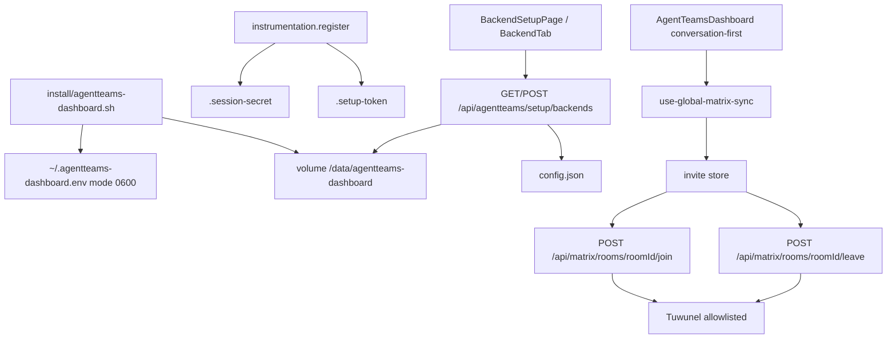

# 嵌入式体验与安全治理

Feature Name: dashboard-embed-ux-governance
Updated: 2026-09-22

## Locked Decisions (2026-09-22)

1. 登录且无 URL hash、无有效 localStorage section 时，默认主表面为 `chat`。
2. Standalone 且 `DASHBOARD_SESSION_SECRET` 缺失时，进程启动自动生成并落盘 `.session-secret`（mode 0600）；Shared Mode 仍 fail-closed。
3. Matrix 邀请第一期包含接受与拒绝（join + leave 代理 + Inbox + HITL 计数）。

## Description

在现有 F1 双地址配置、安装脚本密钥生成、分组导航与 Matrix 长轮询之上，补齐四条缺口：

1. 会话密钥在无安装脚本路径（纯镜像 `docker run`）下也能生成并落盘；安装脚本补挂数据卷与 `AGENTTEAMS_DEPLOYMENT_MODE=embedded`。
2. 嵌入式探测成功时自动预填内网地址（可编辑），设置页空槽显示嵌入式草稿。
3. 登录后默认进入对话优先壳：图标轨 + 聊天三栏；资源管理仍按现有 section 可达。
4. 消费 `/sync` 的 `rooms.invite`，提供接受/拒绝，经允许列表代理 join/leave。

安全治理贯穿：密钥 `0600`、setup token 启动打印合同保持、匿名拓扑不泄露、join/leave 无任意 URL 上游、审计写邀请动作。

## Deep-dive Findings (2026-09-22)

对照安装脚本、sync filter、导航代码与文档后，下列缺口必须写进实现，上一版方案漏了路径对齐。

### F-1 数据卷挂载路径错位（阻断密钥/配置持久化）

| 入口 | 现状 |
|------|------|
| `backend-config.ts` `configFilePath()` | 默认 `/data/agentteams-dashboard/config.json`，token 文件同目录 `.setup-token` |
| `install/agentteams-install.sh` | 创建卷 `agentteams-dashboard-data`，挂到 **`/app/db`**，注释写 "for future use"；**未**注入 `DASHBOARD_CONFIG_FILE`、`DASHBOARD_SESSION_SECRET`、`AGENTTEAMS_DEPLOYMENT_MODE` |
| `install/agentteams-dashboard.sh` | 声明 `DATA_VOLUME=agentteams-dashboard-data`，`docker run` **完全不挂卷**；只把 session secret 写入宿主机 `~/.agentteams-dashboard.env` |

后果：主安装器路径上配置文件与 `.session-secret` 写进容器可写层，重建即丢。独立 dashboard 脚本路径上 F1 配置同样落在容器内。本规格把两处脚本的挂载统一为：

```text
-v agentteams-dashboard-data:/data/agentteams-dashboard
-e DASHBOARD_CONFIG_FILE=/data/agentteams-dashboard/config.json
```

`/app/db` 无代码消费者，废弃该挂载，避免双路径。已有卷若已写入 `/app/db`，升级脚本检测非空则额外 bind 一次并 stderr 警告，一轮后只保留新路径。

### F-2 主安装器漏会话密钥

`agentteams-install.sh` 的 dashboard `env_args` 不含 `DASHBOARD_SESSION_SECRET`。走主安装器的嵌入式部署登录会 hit `requireSecret()` fail-closed。本规格要求该脚本与 `agentteams-dashboard.sh` 一样：空则 `openssl rand -hex 32`，写入 `agentteams-manager.env`（或独立 dashboard env），注入容器。

### F-3 嵌入式预填 vs 安装器已注入 URL

主安装器已写入 `AGENTTEAMS_CONTROLLER_URL=http://${CTRL_CONTAINER}:8090` 与 `NEXT_PUBLIC_MATRIX_API_URL=http://${CTRL_CONTAINER}:6167`。`backendCandidates()` 会把 env 算进候选，`configured` 对 Required Backends 已为 true，GET backends **跳过** embedded 探测。

因此「未配置才探测」对标准嵌入式安装几乎走不到。预填必须覆盖第二种入口：设置页 `BackendTab` 在 `config.internal` 为空时，用 `EMBEDDED_DEFAULTS` 填草稿（可编辑），即使 `configured===true`（地址来自 env）。首次启动页只在 `configured===false` 时自动填。两种入口都允许覆盖 env。

### F-4 Sync filter 默认会带上 invite

当前 `SYNC_FILTER` 只关 presence / account_data / ephemeral 类型，**未**设置 `room.rooms.invite` 排除。Matrix 规范：未点名的房间类别默认包含。因此 `rooms.invite` 已经随 `/sync` 到达客户端，只是 `use-global-matrix-sync.ts` 丢弃了该段。实现只补 ingest，不必改 filter。单测用带 `rooms.invite` 的 fixture 锁住「filter 未排除 invite」这一隐含合同。

### F-5 导航文档与代码三套并存

| 来源 | 结构 |
|------|------|
| `nav-items.ts`（权威） | 三组：基础（总览/聊天）、运行时、资源中心。无文档入口 |
| `.monkeycode/docs/模块/Dashboard.md` | 仍写「五组：总览、智能体、AI 网关、平台、治理 + 常驻文档」——zen 规格残留 |
| `mvp-dashboard-simplification` | 七个一级入口含文档 |

本规格布局增量以 **`nav-items.ts` 为唯一权威**：不恢复五组 zen，不恢复文档常驻项。对话优先 = 默认 section 改 `chat` + 聊天 badge（未读房间数 + 邀请数）写入已有 `countMap.chat`。侧栏视觉保持现有分组列表，本轮不做独立「图标轨」重做，避免与 MVP 精简冲突。

### F-6 Join 端点选择

Client-Server spec：

- `POST /_matrix/client/v3/join/{roomIdOrAlias}` 同时接受 `!room:hs` 与 `#alias:hs`
- `POST /_matrix/client/v3/rooms/{roomId}/join` 只接受 `!` 房间 ID

Inbox 来自 `rooms.invite` 的 key，规范保证是 `!` 房间 ID。实现仍走 **`POST /_matrix/client/v3/join/{encodeURIComponent(roomId)}`**，一份代理覆盖别名邀请（若后续从其它入口进来）。roomId 形状：`!` 或 `#` + 本地 part + `:` + server。现有 `rooms/[roomId]/*` 路由未做形状校验，本规格只在 **写动作** join/leave 加校验（发送消息保持现状，避免扩大回归）。

### F-7 登录前 token 与 GET 匿名面

`GET /api/agentteams/setup/backends` 已对无会话调用方剥离 `backends.candidates`。`embedded.defaults` 是源码常量，匿名可见，符合现有合同。Header 优先传递 setup token 时，须同步改 `BackendSetupPage` 的 reconfigure refetch，避免继续把 token 写进访问日志。

### F-8 AgentTeams 1.2.4 能力对照（2026-09-22）

上游仓库锁定为 [agentscope-ai/AgentTeams](https://github.com/agentscope-ai/AgentTeams) 标签 `v1.2.4`（2026-09-20，`8765d69`）。发布说明原文：「新增管理 API 不代表所有 Dashboard 页面已完成适配」。Dashboard 当前标签 `v1.2.4.9` 已消费其中大部分读侧；下列差集**不并入本规格四项缺口**，单独跟进。

| 上游 PR | Controller 能力 | Dashboard 现状 |
|---------|-----------------|----------------|
| #1231 | Worker runtime-config | 已接 `WorkerRuntimeConfigPanel` |
| #1219 / #1269 | 频道矩阵 10 端点（含 `share_session_in_group`） | 已接 `WorkerChannelsPanel` + `channel-field-templates.ts` |
| #1255 | 内置工具设置 | 已接 `WorkerToolsPanel` |
| #1295 | Worker 会话只读列表/详情/状态 | 已接 `WorkerChatsPanel`（头像入口） |
| #1216 / #1273 | 工具审批 + OFF 门控 | 已接 `WorkerApprovalControl` |
| #1233 / #1230 | 任务事件流 + 任务级巡检 | 已接 `project-events-panel` / 任务展开块 |
| #1247 | 心跳运行时任务状态 | 已接 `useWorkerAgentStatusMap` |
| #1270 | 只读审计 | 已接 L2 自审 / L3 全审 |
| #1242 | `GET /api/v1/gateway/ai-routes` | 已接 `useGatewayRouteCatalog`（Console 会话降级只读） |
| #1250 | `GET /api/v1/mcp-servers` | 已接 `useMcpCatalog` wired-workers 列 |
| #1208 | 团队知识库文件 REST | **刻意不接**：知识库走 Docker archive tarball（插件同款） |
| #1209 / #1277 | Human PUT + Worker 只读范围 | 已接 human 编辑对话框 `accessibleWorkers` |
| #1204 | DeepSeek Harness 运行时 | 已接运行时选择器 |
| #1289 | 项目列表 `updated_at` | 已接类型字段 |
| **#1252** | Worker 技能运行时状态 + 预加载策略 | **无 BFF、无 UI** |
| **#1294** | 子 Agent 独立模型（团队默认 + 热更新，L1-only） | **无 BFF、无 UI** |
| **#1238 / #1211 / #1267** | 团队技能目录 / workbench 只读目录 / 插件自带技能源 | 技能中心仍是 MinIO `custom\|nacos\|builtin`，无 `plugin` 源 |
| **#1242 另一半** | `GET /api/v1/models` | 未代理；模型选择走 Higress Console + SGLang `/v1/models` |
| **#1186** | Worker checkpoint 图/状态 | 文档称「只读面板」，`src/components` 下无 checkpoint UI / 无 `/checkpoints` 路由 |
| **#1249** | 发送前过时回复对齐门 | Matrix 频道发送侧，非面板 UI；`share_session_in_group` 已在频道表单 |
| **#1253** | `loops/status` session 选择器 | runtime-config 仅整块 `loop_config` JSON，无独立 loops 代理 |
| 项目 CRUD | `POST`/`DELETE /api/v1/projects` | 文档约定：创建走聊天 projectflow；删除无入口 |

安装脚本默认镜像仍是 `v1.2.2`（`install/agentteams-dashboard.sh` / `agentteams-install.sh` / `.ps1`）。上游安装器已在 #1298 把默认 Dashboard 升到 `v1.2.4.9`。本规格已改这两处脚本（F-1 / F-2 卷与密钥），**顺带把默认标签改为 `v1.2.4.9`**，与发布标签对齐；PowerShell 入口同步。测试脚本里写死 `v1.2.2` 的断言一并改。

不进本规格的跟进（不写 tasklist）：#1252 技能运行态、#1294 子 Agent 模型、技能目录三源（#1238/#1211/#1267）、checkpoint 只读面板、`GET /api/v1/models`。

## Architecture



解析优先级保持不变：配置文件 > 环境变量 > 嵌入式默认。探测与保存路径不改凭证，只改地址。

## Components and Interfaces

### 1. 安装脚本（两处必须对齐）

`install/agentteams-dashboard.sh` 与 `install/agentteams-install.sh` 的 dashboard 启动段：

- 空 `DASHBOARD_SESSION_SECRET` 时 `openssl rand -hex 32`，写入各自 env 文件 mode 600，并 `-e` 注入。
- `docker volume create agentteams-dashboard-data`；挂载 **`/data/agentteams-dashboard`**（与 `configFilePath()` 默认一致）。废弃 `/app/db`。
- 注入 `DASHBOARD_CONFIG_FILE=/data/agentteams-dashboard/config.json`。
- controller 在 `agentteams-net` 上时注入 `AGENTTEAMS_DEPLOYMENT_MODE=embedded`。
- `agentteams-dashboard.sh` 的 `save_env` 模板补 `DASHBOARD_CONFIG_FILE` 与 `AGENTTEAMS_DEPLOYMENT_MODE`，升级不丢字段。

### 2. 进程启动 `src/instrumentation.ts` + `src/lib/dashboard-session.ts`

新增 `bootstrapSessionSecret()`（与 `bootstrapSetupToken()` 并列）：

| 条件 | 行为 |
|------|------|
| Shared Mode 且密钥缺失/过短 | fail-closed，现有抛错 |
| Standalone 且环境已有 ≥64 hex | 使用环境值，不写文件 |
| Standalone 且 `.session-secret` 存在且合法 | 读入 `process.env.DASHBOARD_SESSION_SECRET` |
| Standalone 且两者皆无 | `randomBytes(32).toString('hex')`，`writeFile(..., { mode: 0o600 })`，stderr 打印 `[dashboard] session secret fingerprint: …xxxx` |

`requireSecret()` 在 bootstrap 之后调用时即可拿到进程内值。禁止在 login 的 502 正文回传该错误原文（SEC-09 已修，回归覆盖）。

### 3. 嵌入式预填

服务端：`GET /api/agentteams/setup/backends` 的未配置探测路径已存在。保持匿名响应不含 `backends.candidates`。

客户端：

- `BackendSetupPage`：Required Backends 全健康时调用现有 `applyEmbeddedDefaults()`（从 `useEffect` 在 `setEmbeddedHealthy(true)` 之后自动执行一次）；Operator 随后的 `setSlot` 覆盖草稿。
- `BackendTab`：`initialFields` 对空 `internal` 且 `embedded.healthy[name]===true` 填 `EMBEDDED_DEFAULTS[name]`，槽位旁文案「嵌入式探测」。保存仍只提交非空槽。

登录前 token 传递：新 fetch 使用 `Authorization: Bearer`；保留 `?token=` 一轮以便旧书签，服务端两者都验，header 优先。

### 4. 对话优先壳

权威导航是 `nav-items.ts` 现有三组（基础 / 运行时 / 资源中心）。本轮不做图标轨重做、不恢复 zen 五组或文档常驻项。

改三处：

- `use-active-section.ts` 的 `resolveInitialSection()` 最终回退从 `'overview'` 改为 `'chat'`。已有 hash 与 localStorage 优先。
- `agent-teams-dashboard.tsx` 的 `countMap` 增加 `chat`：未读房间数（`useRoomMetaStore` 中 `unreadCount>0` 的房间个数）+ `useInviteStore.pendingCount()`。现有 workers/teams/managers 计数保持。
- 聊天全高布局已存在；默认主表面为 chat 时跳过面包屑（现状已按 section===chat 分支）。

HITL 卡片 `hitl-inbox-card.tsx` 增加邀请计数，空确认+空暂停但有邀请时卡片仍渲染。点击邀请行调用 `takePendingInbox()`（渲染期原子消费）并 `setActiveSection('chat')`。

### 5. Matrix 邀请

新增：

- `src/lib/matrix-invite-store.ts`：zustand。`invites: Record<roomId, Invite>`，`upsert` / `dropByRoomId` / `pendingCount`。
- `use-global-matrix-sync.ts`：在现有 `rooms.join` 循环旁增加 `rooms.invite` / `rooms.leave` ingest。
- `src/lib/matrix-api.ts`：`joinRoom` / `leaveRoom`。
- 路由：`src/app/api/matrix/rooms/[roomId]/join/route.ts`、`leave/route.ts`，复用 `proxy-helper.ts` 的 allowlist + Bearer 头。
- UI：`chat-room-sidebar.tsx` 顶部 `InviteInbox`。

`MatrixSyncResponse.rooms.invite` 类型从 `Record<string, unknown>` 收窄为：

```ts
invite?: Record<string, { invite_state?: { events?: MatrixEvent[] } }>;
```

## Data Models

```ts
interface Invite {
  roomId: string;
  sender: string;
  roomName?: string;
  originTs?: number;
}

interface SessionSecretBootstrap {
  source: 'env' | 'file' | 'generated';
  fingerprint: string;
}
```

配置文件 `DashboardConfig` 不变（`version: 1`, `backends` 双地址）。

Join 代理上游路径：`/_matrix/client/v3/join/{roomId}`（支持 alias）与房间 ID 路径 `PUT /_matrix/client/v3/rooms/{roomId}/join` 二选一。本设计固定：

`POST {homeserver}/_matrix/client/v3/join/{encodeURIComponent(roomId)}`

空 JSON 体。roomId 同时允许 `!` 与 `#` 别名形状；`#` 别名额外校验 `#[A-Za-z0-9._=/-]+:[A-Za-z0-9.-]+`。

## Correctness Properties

- **密钥稳定**：同一数据卷上连续两次启动，`.session-secret` 与 `.setup-token` 字节相等。
- **Shared fail-closed**：Shared Mode 不写 `.setup-token` / `.session-secret`；缺会话密钥则无法 `createSession`。
- **拓扑保密**：无会话且无合法 token 的 GET backends 响应 JSON 不含内网候选 URL 列表（仅含源码内 `EMBEDDED_DEFAULTS`）。
- **预填可覆盖**：自动填入后 Operator 编辑再保存，配置文件中的值为编辑后的 URL。
- **邀请终态**：同一 roomId 不会同时存在于 invite store 与已加入房间列表。
- **允许列表**：join/leave 在 `validateHomeserverUrl` 失败时返回 400 `homeserver-not-allowed`，零上游请求。
- **审计**：每次成功 accept/reject 恰好一条 JSONL 事件。

## Error Handling

| 场景 | 处理 |
|------|------|
| 密钥文件不可写 | 本进程内存持有生成值；stderr 警告 `session secret persist failed`；Shared Mode 仍 fail-closed |
| 嵌入式探测超时 | `healthy[name]=false`；不自动预填 |
| 预填后保存失败 | 表单保留草稿；展示现有 `invalid-token` / `token-required` 映射 |
| join 429/403 | 条目保留；展示 `errcode` |
| roomId 非法 | 400 `{ error: "invalid-room-id" }` |
| allowlist 失败 | 400 `{ error: "homeserver-not-allowed" }` |
| 上游超时 | 504 `{ error: "join-failed" }` 或 `leave-failed` |

## Test Strategy

| 文件 | 覆盖 |
|------|------|
| `dashboard-session.test.ts` | bootstrap 生成/复用/Shared 跳过/指纹不含完整密钥 |
| `backend-config.test.ts` | 现有 token 用例保持；新增「探测全绿才预填」属客户端，见下 |
| `backend-setup-page` 测试 | healthy 全 true 自动 `applyEmbeddedDefaults`；缺一则空表 |
| `backend-tab` 测试 | 空槽嵌入式草稿可编辑 |
| `use-global-matrix-sync.test.tsx` | invite ingest、join 后 drop、leave 后 drop |
| `matrix-invite-store.test.ts` | pendingCount、幂等 upsert |
| `join/route.test.ts` `leave/route.test.ts` | 形状拒绝、allowlist 拒绝、Bearer 必需、成功路径转发 |
| `use-active-section` 测试 | 无 hash 无 storage 时默认 `chat`；`#overview` 仍有效 |
| `nav-items.test.ts` | 聊天 badge 计数契约（若抽纯函数） |

验证命令（项目约定）：

```bash
./node_modules/.bin/tsc --noEmit
./node_modules/.bin/eslint <changed files>
./node_modules/.bin/vitest run <related tests>
```

## Security Governance

- 密钥与 token 文件 `0600`；目录 `0700`。
- 安装脚本 env 文件已是 `0600`；完整 `DASHBOARD_SESSION_SECRET` 只存在于该文件与容器 env，禁止出现在 README 示例真值。
- Matrix 代理继续 `requireAllowlist: true`；join/leave 不新增 `controllerUrl` 类覆盖参数。
- 邀请动作审计 `source_ip` 遵守 `AGENTTEAMS_TRUST_PROXY`。
- `DASHBOARD_SETUP_TOKEN_ENFORCE=0` 的开放风险维持现有启动 warn，本规格不扩大该门。
- 前端 Markdown / A2UI 消毒链不在本规格修改范围。

## Implementation Notes

- feature-implementer 按 task 停等用户确认（MEMORY 约定）。
- 不主动 `git push`。
- 注释保持英文；用户可见文案中文。

## References

- `src/lib/backend-config.ts` — F1 双地址、setup token、Shared Mode
- `src/lib/backend-names.ts` — `EMBEDDED_DEFAULTS` / `REQUIRED_BACKENDS`
- `src/lib/dashboard-session.ts` — 会话 HMAC fail-closed
- `install/agentteams-dashboard.sh` — 安装时 `openssl rand -hex 32`
- `src/hooks/use-global-matrix-sync.ts` — 仅消费 `rooms.join`
- `src/app/api/matrix/proxy-helper.ts` — `requireAllowlist: true`
- `docs/code-review-issues.md` — SEC-05 / SEC-09 回归约束
