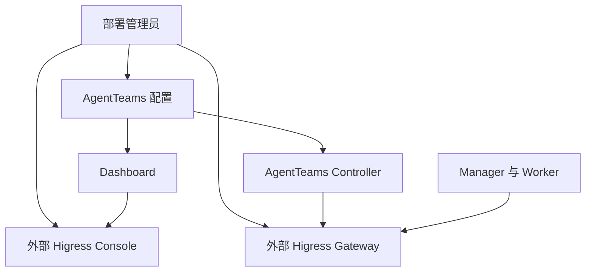
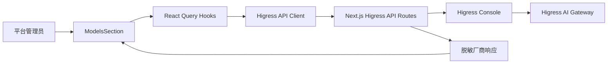

# Higress AI 网关适配设计

Feature Name: higress-ai-gateway
Updated: 2026-07-26

## 描述

本设计扩展现有 Dashboard 的 Higress 集成，使管理员可完整管理模型厂商、模型映射和 AI 路由策略。Higress Console 持有网关配置和敏感凭据；Dashboard 提供受控的配置体验、格式转换、输入校验和错误呈现。

## AgentTeams 外部 Higress 适配

### 结论

AgentTeams 适配已提供 Higress Gateway 具备可行性。部署环境将 `AGENTTEAMS_AI_GATEWAY_URL` 同时注入 Controller、Manager 和 Worker，运行时通过该数据平面地址发送模型请求。Dashboard 的 Provider、Route 管理功能依赖可选的 `AGENTTEAMS_AI_GATEWAY_ADMIN_URL`。两个地址由部署管理员提供，可指向任意网络中的 Higress 服务。

本设计不引入 Higress 容器、Helm Chart、端口映射、安装器探测或 Console 管理员初始化。Docker、Kubernetes 和托管 Higress 都通过相同的两个外部地址完成适配。Dashboard 将 Console 地址限制为部署管理员声明的允许主机名，以保持服务端代理边界。

### 拓扑与职责



| 所有者 | 职责 |
|---|---|
| 部署管理员 | 提供 Higress Gateway 地址、可选 Console 地址、Console 访问权限和允许主机名 |
| AgentTeams 部署配置 | 将 Gateway 数据平面地址透传到 Controller、Manager 和 Worker，将可选 Console 地址和允许主机名注入 Dashboard |
| AgentTeams Controller | 创建和调度 Manager 与 Worker，并向运行时注入网关调用信息 |
| Higress Console | 持久化模型厂商、路由、消费者和认证策略 |
| Dashboard | 读取外部服务状态、管理已授权 Console 的厂商与路由、展示模型绑定、转发共享登录会话 |

### 配置边界

`AGENTTEAMS_HIGRESS_ADAPTER_MODE` 是适配模式的唯一来源：`external` 启用外部 Higress 适配，`direct` 作为默认值保留当前直接模型配置行为。`AGENTTEAMS_AI_GATEWAY_URL` 表示外部 Gateway 数据平面地址，供 Manager 和 Worker 发送模型请求。该值由部署环境提供，Dashboard 只读展示。`AGENTTEAMS_AI_GATEWAY_ADMIN_URL` 表示可选的外部 Console 管理地址，供 Dashboard 登录和配置调用。`AGENTTEAMS_AI_GATEWAY_ADMIN_ALLOWED_HOSTS` 以逗号分隔精确主机名，用于限定该 Console 地址。三个外部 Higress 环境变量由 AgentTeams 部署环境注入，Dashboard 设置页没有写入入口。

当适配模式为 `external` 时，Dashboard 在加载和首次启动期间只调用状态读取接口，`ensure-ai` 不进入调用路径。当适配模式为 `direct` 时，现有首次启动行为保持不变。

外部模式采用双层 Gateway 约束。AgentTeams Controller 是运行时地址的最终事实来源：当 `AGENTTEAMS_HIGRESS_ADAPTER_MODE=external` 时，Controller 忽略 Manager 和 Worker `modelProvider` 解析出的 `IntranetURL`，并使用 `WorkerEnv.AIGatewayURL` 生成 Manager、Worker 和运行时 OpenClaw 配置。Dashboard 在创建、更新、启动、唤醒和就绪入口提前拒绝非空 `modelProvider`，使管理员在运行时调谐前获得明确迁移提示。该策略覆盖 Dashboard 调用和直接 Controller API 调用。

Dashboard 的首次启动向导当前通过 Controller 的 `/api/v1/setup` 设置 `llmProvider`、`llmApiKey` 和可选 Base URL。外部 Higress 接入启用后，Manager 和 Worker 的 `model` 字段统一为请求模型别名，运行时将该别名作为模型请求参数发送到 Gateway，Higress 路由和上游映射将别名解析到具体厂商模型。Dashboard 只在 Console 地址已配置且具备会话权限时展示写入操作。

### 当前实现的实施门槛

1. `ModelSelector` 当前将 Provider 名称写入 Manager 与 Worker 的 `model` 字段，而本设计将该字段收敛为请求模型别名。实现需要迁移现有值，并让 Controller、Manager 和 Worker 使用相同字段语义。
2. `/api/agentteams/setup/ensure-ai` 固定创建 `openai-compat` 上游和 `agentteams-default` 路由。`AGENTTEAMS_HIGRESS_ADAPTER_MODE=external` 时，Dashboard 不调用该流程，首次启动仅执行只读状态检查。
3. Dashboard 的 Console 地址白名单需要从固定列表扩展为 `AGENTTEAMS_AI_GATEWAY_ADMIN_ALLOWED_HOSTS` 声明的精确主机名集合，并在应用启动时校验 `AGENTTEAMS_AI_GATEWAY_ADMIN_URL`。
4. Console 管理地址健康检查与 Gateway 数据平面探针需要分离，Gateway 地址可用时即可展示运行时适配状态。

## 设计目标

- 将模型厂商、模型映射和路由策略拆分为清晰的管理单元。
- 复用现有 Higress Console API 代理和会话 Cookie 转发。
- 让浏览器只获取已脱敏的厂商信息。
- 让配置表单在提交前完成可本地验证的约束校验。
- 让 AgentTeams 模型绑定始终指向可用的网关路由和模型映射。

## 架构



`ModelsSection` 由四个独立面板组成：模型厂商、模型映射、AI 路由和 AgentTeams 模型绑定。Gateway 数据平面状态通过 AgentTeams 配置读取；Console 管理请求通过 `/api/higress/*` 发送。服务端代理负责 Console 地址约束、Cookie 透传、超时和一致错误格式。Higress Console 继续作为可选的配置事实来源。

### 外部 Higress 状态接口

扩展 `GET /api/agentteams/infrastructure`，以 `higress` 字段替换现有单一状态：

```ts
interface ExternalServiceStatus {
  configured: boolean;
  endpoint?: string;
  state: 'unconfigured' | 'reachable' | 'unreachable';
  httpStatus?: number;
  error?: string;
}

interface HigressStatus {
  mode: 'direct' | 'external';
  gateway: ExternalServiceStatus;
  console: ExternalServiceStatus;
}
```

服务端对每个已配置地址发送一个 `GET /` 探测，并设置 5 秒超时。任何收到 HTTP 响应的地址状态为 `reachable`；网络错误和超时状态为 `unreachable`；缺失地址状态为 `unconfigured`。Console 状态仅用于决定 Dashboard 的管理功能可用性；Gateway 状态用于展示 AgentTeams 运行时适配状态。

## 组件与接口

### Higress API Client

扩展 `src/lib/higress-api.ts`：

- 统一定义厂商配置、令牌故障转移、模型映射、路由上游、路由认证与回退策略的 TypeScript 类型。
- 将厂商的 `rawConfigs` 约束为明确的可编辑字段，保留 Higress 返回的未知字段以兼容后续扩展。
- 定义表单模型与 Console 请求模型之间的转换函数。

### React Query Hooks

扩展 `src/hooks/use-agentteams-models.ts`：

- 保留 `useModels` 与 `useAiRoutes` 的 30 秒刷新策略。
- 使用更新 mutation 管理厂商和路由编辑。
- 任何成功的厂商变更同时失效厂商列表与路由列表缓存。
- 路由变更失效路由列表缓存。

### ModelsSection

重构 `src/components/dashboard/sections/models-section.tsx`：

- 厂商表格提供详情和编辑入口。
- 厂商表单根据类型显示 Base URL、协议、Token 故障转移和模型映射。
- 路由表格提供详情和编辑入口。
- 路由表单支持多个上游、权重、每上游模型映射、模型谓词、认证和回退策略摘要。
- 模型绑定表格展示 AgentTeams 模型值、路由名称、映射目标和可用状态。
- 删除操作使用确认对话框，避免误触提交到网关。

### Next.js Higress API Routes

保留以下服务端边界：

| Dashboard 路径 | Higress Console 路径 | 行为 |
|---|---|---|
| `/api/higress/ai-providers` | `/v1/ai/providers` | 厂商列表与创建 |
| `/api/higress/ai-providers/[name]` | `/v1/ai/providers/[name]` | 单厂商读取、更新、删除 |
| `/api/higress/ai-routes` | `/v1/ai/routes` | 路由列表与创建 |
| `/api/higress/ai-routes/[name]` | `/v1/ai/routes/[name]` | 单路由读取、更新、删除 |

厂商 GET 响应在 API 路由中移除 `tokens` 并返回 `tokenCount`。更新请求仅在用户明确填写新 Token 时携带 `tokens` 字段。

## 数据模型

```ts
type ModelMapping = Record<string, string>;

interface TokenFailoverConfig {
  enabled: boolean;
  failureThreshold: number;
  successThreshold: number;
  healthCheckInterval: number;
  healthCheckModel: string;
}

interface ProviderForm {
  name: string;
  type: string;
  protocol: 'openai/v1' | 'original';
  tokens: string[];
  baseUrl?: string;
  tokenFailoverConfig?: TokenFailoverConfig;
  modelMapping: ModelMapping;
}

interface RouteUpstreamForm {
  provider: string;
  weight: number;
  modelMapping: ModelMapping;
}

interface RouteForm {
  name: string;
  pathPredicate: { matchType: string; matchValue: string };
  upstreams: RouteUpstreamForm[];
  modelPredicates: Array<{ matchType: string; matchValue: string }>;
  authConfig: { enabled: boolean; allowedCredentialTypes: string[] };
  fallbackConfig?: Record<string, unknown>;
}

interface AgentTeamsModelBinding {
  requestModelAlias: string;
  routeName: string;
  providerName: string;
  targetModel: string;
  available: boolean;
}
```

序列化规则：

- `ProviderForm.baseUrl` 映射为 Higress 所需的 `rawConfigs.openaiCustomUrl`。
- 模型映射保持为 `Record<string, string>`，以支持精确键、前缀通配符、`*` 和正则键。
- 更新厂商时，空 `tokens` 表示请求负载省略 `tokens`。
- 路由上游权重以整数百分比发送，所有上游权重总和为 100。
- `requestModelAlias` 是 Manager 和 Worker 写入 `model` 字段并发送给 Gateway 的唯一模型标识。

## 正确性属性

1. 任何发往浏览器的模型厂商响应都不包含凭据值。
2. 可提交的 AI 路由至少包含一个现存模型厂商。
3. 含多个上游的可提交 AI 路由权重总和等于 100。
4. 启用 Token 故障转移的可提交厂商具备正整数阈值、正整数间隔和非空健康检查模型。
5. 启用路由认证的可提交 AI 路由包含至少一个凭据类型。
6. 厂商配置写入成功后，厂商列表和路由列表会在下次渲染时读取新配置。
7. 请求模型别名仅在绑定路由、上游厂商和目标模型均可用时标记为可用。
8. 外部 Higress 适配模式下，页面加载和首次启动不会创建 Consumer、Provider 或 AI Route。
9. 外部 Higress 适配模式下，Manager 和 Worker 的运行时 Gateway 地址等于配置的 `AGENTTEAMS_AI_GATEWAY_URL`，且不受 `modelProvider` 解析结果影响。

## 错误处理

| 场景 | Dashboard 行为 |
|---|---|
| Higress 返回验证错误 | 在表单内显示 Console 返回的错误并保留输入 |
| Higress 返回认证错误 | 显示共享登录会话失效提示 |
| Higress 请求超时 | 显示超时错误，表单恢复可编辑状态 |
| 厂商被路由引用 | 在删除前显示引用路由，并由 Higress 返回最终删除结果 |
| 路由引用不存在厂商 | 在表单中标记该上游，保存操作保持禁用 |
| Console 与 Gateway 地址混用 | 展示地址类型和对应健康状态，并阻止将 Console 地址写入运行时网关配置 |
| 外部 Console 主机未获授权 | 拒绝代理请求并提示部署管理员更新允许主机名配置 |
| 外部适配模式首次启动 | 仅查询 Gateway 和 Console 状态，不发起任何 Console 配置写入 |
| 外部适配模式缺少 Gateway 地址 | 返回 `gateway.state = unconfigured` 并显示部署配置要求 |
| 外部模式携带模型提供方 | Dashboard 返回 409 并说明请求模型别名与 AI Route 迁移路径 |
| 外部模式已有模型提供方 | 启动、唤醒和就绪操作返回 409，直到迁移移除模型提供方 |

## 测试策略

### 单元测试

- 厂商响应脱敏仅保留 `tokenCount`。
- 厂商表单序列化正确映射 Base URL、Token 故障转移和模型映射。
- 省略 Token 的更新请求不清空现有凭据。
- 模型映射校验拒绝重复精确键并接受 Higress 支持的匹配语法。
- 路由权重校验接受总和为 100 的上游列表。
- 路由认证校验要求至少一个凭据类型。

### 路由处理测试

- API 路由向 Higress Console 转发请求方法、请求体和 Cookie。
- API 路由返回标准化错误响应。
- API 路由在 15 秒超时后返回 502 错误。

### 组件测试

- 厂商创建、编辑和错误状态。
- 多上游路由编辑和权重即时校验。
- 删除确认与 mutation 成功后的查询失效。
- AgentTeams 模型绑定可用状态与 Provider、Route 变更后的刷新。
- 外部 Gateway 地址由部署配置透传到 Controller、Manager 和 Worker。
- 外部适配模式下首次加载与首次启动仅执行只读请求。
- Console 地址允许主机、非法环境地址和缺失配置的明确失败行为。
- Gateway 与 Console 地址独立成功、失败和误配状态。
- 外部模式下 Manager、Worker 和运行时配置忽略 `modelProvider.IntranetURL` 并保留 Gateway 数据平面地址。

## 实施顺序

1. 为外部 Gateway 数据平面地址建立部署配置到 Controller、Manager、Worker 的透传链路，并添加安装集成测试。
2. 将 `model` 字段迁移为请求模型别名，并添加 Manager、Worker 到 Gateway 的端到端路由命中测试。
3. 从部署环境读取外部适配模式、可选 Console 管理地址和允许主机名，并在应用启动时校验。
4. 为外部适配模式增加只读就绪检查，并从该模式的页面加载和首次启动路径排除 `ensure-ai`。
5. 将基础设施 Higress 状态替换为独立的 Gateway 和 Console 状态接口，并添加四种组合状态测试。
6. 扩展 Higress 类型、表单序列化与纯函数校验，并添加单元测试。
7. 增强模型厂商表单和厂商详情编辑流程。
8. 增强 AI 路由表单，加入多上游、模型映射、认证和模型绑定。
9. 补齐 API 路由请求校验、脱敏和错误测试。
10. 运行 `npm run lint`、`npm run typecheck` 和 `npm test`。
11. 在 AgentTeams Controller 外部模式下屏蔽 `modelProvider` 的内网地址覆盖，并以 Dashboard 门禁阻止新增和遗留引用。

## 已确认决策

1. 路由回退策略首期采用受限 JSON 编辑器。实现以目标 Higress Console 的固定 API 版本和允许的 `fallbackConfig` schema 为验收基线；Console 不支持写入时展示只读摘要。编辑器保留 Console 返回的未知字段，并在提交前校验 JSON 与允许 schema。
2. 外部模式的 Gateway 地址以 AgentTeams Controller 配置为权威；`modelProvider` 在外部模式不参与 Manager、Worker 与运行时配置的 Gateway 地址选择。Dashboard 与 Controller 共同实施约束，避免直连 Controller 绕过 Dashboard 校验。

## 参考

[^1]: Higress AI Proxy Provider 配置：https://github.com/higress-group/higress/blob/main/plugins/wasm-go/extensions/ai-proxy/README_EN.md
[^2]: `src/lib/higress-api.ts#L8`：当前 Higress 客户端类型与 Console API 方法。
[^3]: `src/app/api/higress/proxy-helper.ts#L4`：Console 代理、地址校验和超时处理。
[^4]: `src/components/dashboard/sections/models-section.tsx#L41`：当前模型厂商与 AI 路由管理界面。
[^6]: `src/components/dashboard/sections/shared/model-selector.tsx#L25`：当前 Manager 和 Worker 模型选择值来源。
[^7]: `src/app/api/agentteams/setup/ensure-ai/route.ts#L45`：当前 Consumer 与默认 AI Route 的修复流程。
