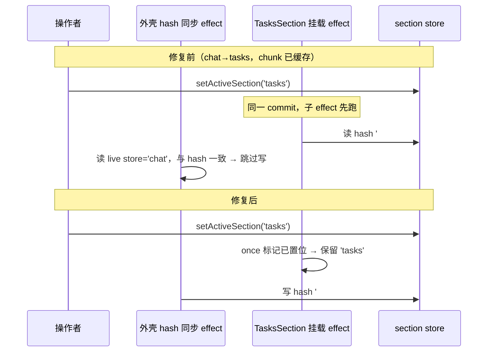
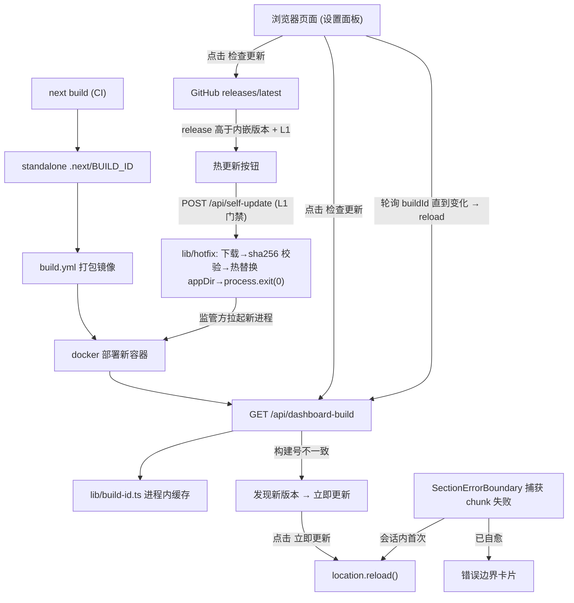

# 线上版本热更新与任务看板切换修复

Feature Name: hot-update-nav-fix
Updated: 2026-09-29

## Description

生产环境以 docker 镜像运行（`build.yml` 发布预构建镜像）。本设计覆盖两项：

1. **任务看板切换失效**：真实根因为 `useActiveSection()` 的初始解析 effect 随组件挂载重复执行。TasksSection（`tasks-section.tsx:523`）挂载时把「当前 URL hash」重新写回 store——chat→tasks 同 commit 同步挂载路径下读到的 hash 还是旧值 `#chat`，切换被瞬间回滚。修复为模块级 once 标记：初始解析每个应用生命周期只执行一次。
2. **按钮式线上热更新（应用内热补丁）**：设置面板新增「更新」tab——对比页面构建号与服务器构建号（`/api/dashboard-build`），不一致则一键刷新追平；同时对比 GitHub 最新 release 与构建内嵌版本。**管理员（L1）可点击「热更新」触发应用内补丁**：后端下载最新 Release 附带的热更新包（`dashboard-hotfix-*.tar.gz`，sha256 校验），热替换应用目录（旧版保留于 `app.prev`），进程退出交由容器监管方（docker restart 策略 / k8s restartPolicy）拉起——无 docker socket、无旁路容器，docker 与 k8s 行为一致；页面轮询 `/api/dashboard-build` 直到构建号变化后自动 reload。配套 chunk 自愈覆盖刷新前旧资源失效窗口。

时序图（bug 机理与修复后对照）：



## Architecture



## Components and Interfaces

| 组件 | 文件 | 职责 |
|------|------|------|
| 初始解析 once 化 | `src/components/dashboard/use-active-section.ts` (修复) | 模块级 `initialResolutionDone` 标记，挂载 effect 仅首置位生效 |
| 回归测试 | `src/components/dashboard/use-active-section.test.ts` (扩展) | 复现并锁定：remount 不回滚 store |
| 侧栏拖拽清理 | `src/components/dashboard/sections/chat/chat-room-sidebar.tsx` (修复) | resize 处理器入 ref，卸载统一移除 |
| 构建版本读取器 | `src/lib/build-id.ts` (新增) | 读 `.next/BUILD_ID` 一次并缓存；失败返回 `'unknown'` 仅告警一次 |
| 构建版本接口 | `src/app/api/dashboard-build/route.ts` (新增) | `GET` → `200 { buildId, builtAt }`，免认证 |
| 检查更新 Hook | `src/hooks/use-update-check.ts` (新增) | 并行取服务器构建号与 GitHub release，状态机 idle/checking/uptodate/update-available/refresh |
| 检查更新 UI | 设置面板新增「版本与更新」区块 (`settings-dialog.tsx`) | 当前构建信息 + 检查更新按钮 + 各状态提示 |
| chunk 自愈 | `src/components/dashboard/section-error-boundary.tsx` (增强) | 识别 chunk 类错误，会话内首次延迟 ~1.5s 刷新 |
| 容器自更新触发 | `src/app/api/self-update/route.ts` (新增) | L1 门禁（session.level≥3），取最新 Release → 版本门禁 → `lib/hotfix.applyHotfix` → 审计 → 响应后 `process.exit(0)` 交监管方重启 |
| 热补丁执行器 | `src/lib/hotfix.ts` (新增) | 资产选择（`dashboard-hotfix-*` 前缀）、限流下载（800MB 上限）、sha256 校验、tar 解包 + server.js/BUILD_ID 完整性检查、目录原子换装（旧版留 `app.prev`）、并发防重入 |
| 容器更新流 | `src/hooks/use-update-check.ts` (扩展) | `updateContainer()`: 触发后轮询 `/api/dashboard-build`（2s 间隔，5min 上限），容器重启期的连接失败静默重试，buildId 变化即 reload；超时报错 |
| 补丁包构建 | `scripts/build-hotfix-bundle.sh` (新增) | 发布期打包 standalone+public+static 为 tar.gz + sha256，上传为 Release assets |

### 接口定义

```ts
// GET /api/dashboard-build → 200
{ "buildId": "bGzF3Kx8...", "builtAt": "2026-09-29T08:03:00Z" }

// src/lib/build-id.ts
export function getBuildId(): string
// 首次调用读 process.cwd()/.next/BUILD_ID 与其 mtime；dev 与 standalone 均存在该文件
// 失败 → 'unknown'，仅 warn 一次

// src/hooks/use-update-check.ts
type UpdateCheckState =
  | { phase: 'idle' }
  | { phase: 'checking' }
  | { phase: 'error'; message: string }
  | { phase: 'uptodate' }
  | { phase: 'update-available'; serverBuildId: string; builtAt?: string }
  | { phase: 'upstream-available'; latestVersion: string };
export function useUpdateCheck(): { state: UpdateCheckState; check: () => void; applyUpdate: () => void }
// check(): 并行 GET /api/dashboard-build 与 GitHub releases/latest（10s 超时）
//   页面构建号 = 客户端构建时内嵌（next/next.config 注入），与服务器返回对比
//   GitHub 对比基准 = 构建时内嵌 package.json version（semver 比较）
// applyUpdate(): location.reload()

// section-error-boundary 自愈
// 识别：error.name === 'ChunkLoadError' 或 message 含 'Failed to fetch dynamically imported module'
// 流程：sessionStorage['agentteams-chunk-heal'] 未置位 → 置位 → 1.5s 后 reload
//      已置位 → 现有错误卡片（现状行为）
```

版本内嵌方案：客户端页面构建号取 `next.config.ts` `generateBuildId()`（默认即唯一 Build ID），经环境变量在构建期写入 `process.env.NEXT_PUBLIC_BUILD_ID` 供浏览器代码读取；构建时间经同机制注入。服务器构建号运行时读文件，二者同源（同一次 next build），可比对。

## Data Models

- **API 响应**: `{ buildId: string; builtAt: string }`（builtAt 取 BUILD_ID 文件 mtime 的 ISO 串，读取失败则缺省）
- **sessionStorage**: `agentteams-chunk-heal = '1'`
- **Hook 状态机**: 见上方 `UpdateCheckState`，全部内存态
- **use-active-section**: 模块级 `let initialResolutionDone = false`，纯内存

## Correctness Properties

1. 初始解析每应用生命周期至多执行一次；组件任意次重挂载均保留 store 当前值
2. hashchange 深链/前进后退行为与现状完全一致（既有测试全绿）
3. 同一进程生命周期内 `/api/dashboard-build` 响应恒定
4. chunk 自愈自动刷新每会话至多一次
5. 版本接口/GitHub 不可用时，「检查更新」提示失败并保留重试，页面其余功能零影响
6. 侧栏拖拽中卸载组件后，window 上无残留 pointermove/pointerup 监听器

## Error Handling

| 场景 | 处理 |
|------|------|
| `.next/BUILD_ID` 读取失败 | `buildId='unknown'`，服务端单次 warn |
| 页面构建号 vs 服务器均为 unknown | 视为一致，提示已是最新（避免 unknown≠unknown 误报） |
| GitHub API 限流/网络失败 | 上游对比结果标记为不可用，服务器构建号对比结果照常展示 |
| 检查请求超时（10s） | `phase='error'`，展示重试入口 |
| 自愈刷新后仍 chunk 失败 | 现有错误边界卡片，等待人工刷新或下次部署 |
| 更新器未配置/无热更新包 | Release 缺 `dashboard-hotfix-*` 资产时路由返回 404，提示走镜像部署 |
| 非 L1 用户触发 | 路由返回 403，UI 隐藏「热更新」按钮 |
| sha256 校验失败 | 中止且运行中版本零改动（staging 清理） |
| 应用目录不可写（k8s readOnlyRootFilesystem） | 明确报错并提示放开只读限制 |
| 热更新期间连接失败 | 属预期（进程重启中），轮询静默重试直至 buildId 变化或超时 |
| 更新超时（5min 内 buildId 未变化） | UI 报「更新超时」并提示检查容器状态 |
| 重复触发 | 防重入守卫返回 409「热更新进行中」 |
| 补丁在 Pod 重建后丢失 | 预期语义：热补丁是快速通道，下一次镜像构建包含同样代码后自然收敛 |
| 拖拽中切走 chat 区块 | 卸载清理函数移除 window 监听器 |

## Test Strategy

**单元测试（vitest）**

1. `use-active-section.test.ts` 扩展：置 hash='#chat' + store='chat' → 切 store 到 'tasks' → 重挂载 useActiveSection → 断言 store 保持 'tasks'（修复前该用例红，修复后绿）；既有 9 个用例保持全绿
2. `build-id.test.ts`：正常读取、缓存命中、异常返回 unknown 仅一次告警
3. `dashboard-build route.test.ts`：200 形状、异常 unknown、连续请求稳定
4. `use-update-check.test.ts`：状态机迁移——checking/uptodate/update-available/upstream-available/error、applyUpdate 触发 reload
5. `section-error-boundary` 增强：chunk 错误 + 会话首次 → reload 一次；已置位 → 错误卡片；非 chunk 错误 → 现状
6. `chat-room-sidebar.test.ts`：拖拽中卸载 → removeEventListener 调用（spy）

**人工验收**

1. dev 与生产构建下连续 10 次「chat→任务看板」首点全部生效（含 chunk 已缓存场景）
2. 部署新镜像后：旧页面打开设置 → 检查更新 → 出现「发现新版本」→ 点击更新 → 页面追平
3. 浏览器前进/后退深链行为抽查

## References

[^1]: (Filename#L68) - 初始解析 effect（根因点）: `src/components/dashboard/use-active-section.ts`
[^2]: (Filename#L523) - TasksSection 对 useActiveSection 的调用: `src/components/dashboard/sections/tasks-section.tsx`
[^3]: (Filename#L278) - resize 监听器泄漏点: `src/components/dashboard/sections/chat/chat-room-sidebar.tsx`
[^4]: (Filename) - 镜像发布触发条件: `.github/workflows/build.yml`
[^5]: (Filename) - 设置面板挂载点: `src/components/dashboard/settings-dialog.tsx`
