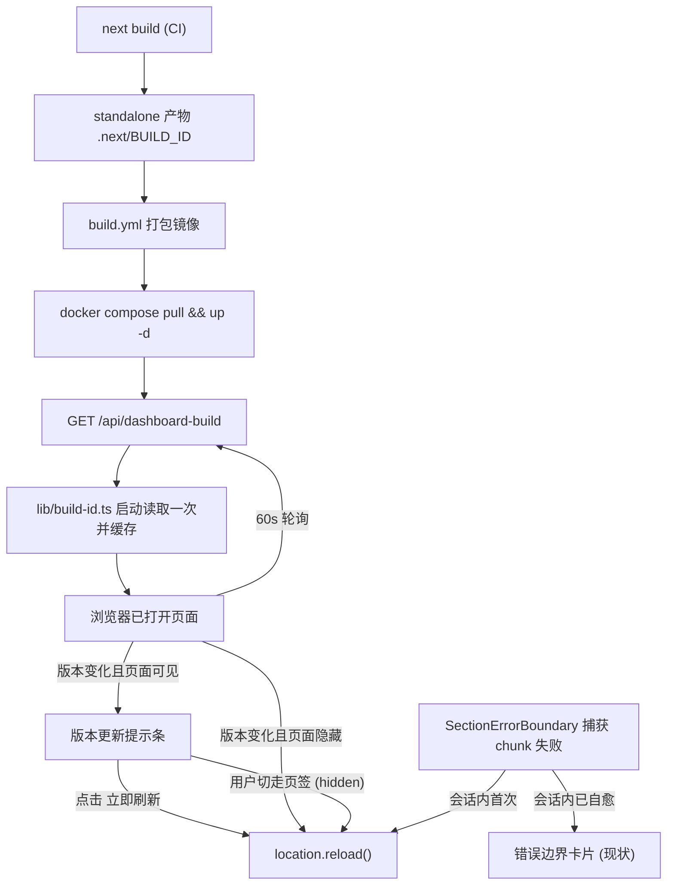

# 线上版本热更新与任务看板切换修复

Feature Name: hot-update-nav-fix
Updated: 2026-09-29

## Description

生产环境以 docker 镜像运行（`deploy/docker-compose.yml` 引用预构建镜像，`build.yml` 仅在打 tag 或手动触发时发布）。当前两个问题：

1. 镜像更新后，已打开的浏览器页面持续运行旧版本，用户必须手动 F5。本设计新增构建版本探测链路：页面每 60 秒比对自己的基线与服务端最新构建版本，后台页签静默刷新、前台页签提示条由用户决策，配合 chunk 自愈覆盖新旧版本交替期的资源失效。
2. 「chat→任务看板首次点击无响应」的源码修复（单树渲染，规避 AnimatePresence 分支互换陷阱）已于 09-26 落地 main，线上镜像构建早于该修复。处置为重新发布镜像并按验收清单部署验证，另附两处防回归加固。

关键前提说明：版本探测能力随新版本页面一起发布。旧页面上线本功能前需要用户手动刷新一次（一次性成本），此后所有后续部署均自动收敛。

## Architecture



刷新决策收敛为一条规则：**版本变化时，页面可见则提示等待，页面隐藏（含提示期间切走页签）则立即刷新**。用户合上笔记本、切到其他页签再回来，看到的即新版本。

## Components and Interfaces

| 组件 | 文件 | 职责 |
|------|------|------|
| 构建版本读取器 | `src/lib/build-id.ts` (新增) | 读 `.next/BUILD_ID` 一次，模块级缓存；读取失败返回 `'unknown'` 并仅告警一次 |
| 版本接口 | `src/app/api/dashboard-build/route.ts` (新增) | `GET` → `200 { buildId: string }`，免认证，零敏感信息 |
| 版本探测 Hook | `src/hooks/use-build-version-probe.ts` (新增) | 基线建立、60s 轮询、指数退避（60s→600s 上限）、变化判定、hidden 刷新与可见提示的状态机 |
| 版本更新提示条 | `src/components/dashboard/version-update-banner.tsx` (新增) | 固定右下角常驻提示 +「立即刷新」按钮 |
| 外壳挂载点 | `src/components/dashboard/agent-teams-dashboard.tsx` | 挂载 probe hook 与提示条（约 2 行） |
| chunk 自愈 | `src/components/dashboard/section-error-boundary.tsx` (增强) | 识别 chunk 类错误（`ChunkLoadError` / `Failed to fetch dynamically imported module`），会话内首次标记 sessionStorage 后延迟 ~1.5s 刷新 |
| 侧栏拖拽清理 | `src/components/dashboard/sections/chat/chat-room-sidebar.tsx` (修复) | resize 监听器注册进 ref，卸载时统一 removeEventListener |
| 部署文档 | `deploy/docker-compose.yml` 注释 / `deploy/coolify/README.md` (补充) | 部署后浏览器自动收敛说明（无需通知用户手动刷新） |

### 接口定义

```ts
// GET /api/dashboard-build
// 200
{ "buildId": "bGzF3Kx8..." }

// src/lib/build-id.ts
export function getBuildId(): string
// 首次调用读取 process.cwd()/.next/BUILD_ID；dev 模式下该文件同样存在（next dev 生成）
// 失败 → 'unknown'

// src/hooks/use-build-version-probe.ts
export function useBuildVersionProbe(): { updateAvailable: boolean }
// 内部：baseline = 首次成功响应；poll 60s；失败退避 60→120→...→600s
// 变化时：document.hidden → location.reload()
//        可见 → updateAvailable=true，并 arm visibilitychange：转 hidden 即 reload
```

## Data Models

- **API 响应**: `{ buildId: string }`，无其他字段
- **sessionStorage**: `agentteams-chunk-heal = '1'`，自愈刷新前写入（刷新后仍存活，阻断同会话二次自愈）
- **Hook 状态**: `baseline: string | null`、`updateAvailable: boolean`，全部内存态，无持久化

## Correctness Properties

1. 同一进程生命周期内，`/api/dashboard-build` 响应恒定（模块级缓存保证）
2. 版本无变化 ⇒ 客户端零刷新、零 UI 变化、零额外请求（仅 60s 一次探测）
3. chunk 自愈触发的自动刷新在单个浏览器会话内至多一次（sessionStorage 前置标记保证）
4. 版本接口不可用 ⇒ 页面行为与现状完全一致（静默退避，无报错 UI）
5. 静默刷新仅发生于 `document.hidden === true` 时（前台永远由用户点击触发）
6. 版本接口返回 `unknown` 时视为无变化（baseline 与新值同为 unknown ⇒ 不触发）

## Error Handling

| 场景 | 处理 |
|------|------|
| `.next/BUILD_ID` 读取失败（异常打包方式） | 返回 `'unknown'`，服务端单次 warn 日志 |
| 旧版本页面请求新路由 `/api/dashboard-build` | 旧镜像无此路由 → 404 → 客户端静默退避（旧页面保持现状，符合预期：旧版本无感知能力） |
| 探测请求网络失败/超时 | 指数退避 60s→600s，恢复后正常比对 |
| 提示条展示期间用户长期无操作 | 持续展示，零强制刷新（Requirement 3.4） |
| 自愈刷新后仍 chunk 失败（新部署本身损坏） | 展示现有区块错误边界卡片，维持现状等待下一次探测或人工介入 |
| 多页签同时打开 | 各自独立探测与刷新，互不干扰；后刷新者覆盖前者的状态，均为最新版本 |
| 拖拽中途切走 chat 区块 | 卸载清理函数移除 window 监听器（修复点） |

## Test Strategy

**单元测试（vitest，全部新增文件各配 .test）**

1. `build-id.test.ts`: mock fs —— 正常读取、二次调用命中缓存、异常返回 unknown 且仅一次告警
2. `dashboard-build route.test.ts`: 200 形状、异常时 unknown、连续请求稳定
3. `use-build-version-probe.test.ts`: fake timers —— 基线建立、60s 轮询节拍、版本变化+hidden → reload（mock location.reload）、可见 → updateAvailable、退避序列、unknown 视为无变化
4. `version-update-banner.test.ts`: 渲染、点击触发 reload
5. `section-error-boundary` 增强: chunk 类错误 + 会话首次 → reload 一次；标记已存在 → 错误卡片；非 chunk 错误 → 现状行为
6. `chat-room-sidebar.test.ts`: 拖拽中卸载 → removeEventListener 被调用（spy 验证）

**人工验收（部署后）**

1. Requirement 6.3：连续 10 次「chat→任务看板」首点全部 ≤1s 呈现
2. 热更新端到端：部署新镜像 → 前台页签 60s 内出现提示条，点击刷新为新版；另一后台页签切回即新版
3. chunk 自愈端到端：部署后不刷新旧页面，点击各区块观察自动恢复

## References

[^1]: (Filename#L383) - 单树渲染注释与历史症状记录: `src/components/dashboard/agent-teams-dashboard.tsx`
[^2]: (Filename#L278) - resize 监听器泄漏点: `src/components/dashboard/sections/chat/chat-room-sidebar.tsx`
[^3]: (Filename) - 镜像发布触发条件（tag / workflow_dispatch）: `.github/workflows/build.yml`
[^4]: (Filename) - 现有 controller 版本代理接口（与本次 dashboard 构建版本接口互补）: `src/app/api/agentteams/version/route.ts`
