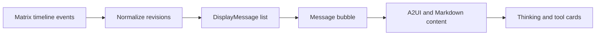

# Matrix 聊天体验优化设计

Feature Name: matrix-chat-experience
Updated: 2026-07-29

## Description

Dashboard 在客户端对 Matrix 时间线执行消息编辑归并。归并后的消息保留根事件 ID，并从最新编辑事件读取内容与流式标记。消息内容组件为简单流式文本提供轻量路径，最终内容使用现有 Markdown 和 A2UI 渲染路径。

## Architecture

## Components and Interfaces

- `formatMatrixEvents`：将事件序列归并为稳定的 `DisplayMessage` 列表。
- `formatMatrixEvent`：转换单个 Matrix 事件，读取标准编辑内容和可选流式标记。
- `ChatPanel`：使用归并后的消息构建日期分隔符与消息列表。
- `A2uiChatContent`：在简单流式文本时使用轻量渲染，在完成状态使用完整解析。
- `ThinkingBlock`：以流式状态作为默认展开条件，并记录用户的手动展开选择。

## Correctness Properties

- 每个有效消息根事件最多生成一个 `DisplayMessage`。
- 编辑事件按时间覆盖同一根事件的显示内容。
- 流式文本路径不执行 A2UI 或 Markdown 解析。
- 用户手动卡片状态优先于默认展开状态。

## Error Handling

- 无根事件引用的编辑事件保留为独立消息。
- 无法识别的流式标记按完成消息处理。
- 不完整的 Markdown 在流式状态按普通文本显示。

## Test Strategy

- 为消息归并覆盖根事件、单次编辑、多次编辑和孤立编辑。
- 为流式标记与最终状态覆盖转换逻辑。
- 为思考卡片覆盖流式默认展开、完成默认收起和手动状态保留。

## References

[^1]: https://atomgit.com/u012823422/T-agent - 流式占位消息、轻量文本路径与完成后折叠交互参考。
[^2]: `src/components/dashboard/sections/chat/chat-panel.tsx` - 当前 Matrix 时间线组装。
[^3]: `src/components/dashboard/sections/chat/a2ui/a2ui-chat-content.tsx` - 当前 A2UI 与 Markdown 渲染入口。
