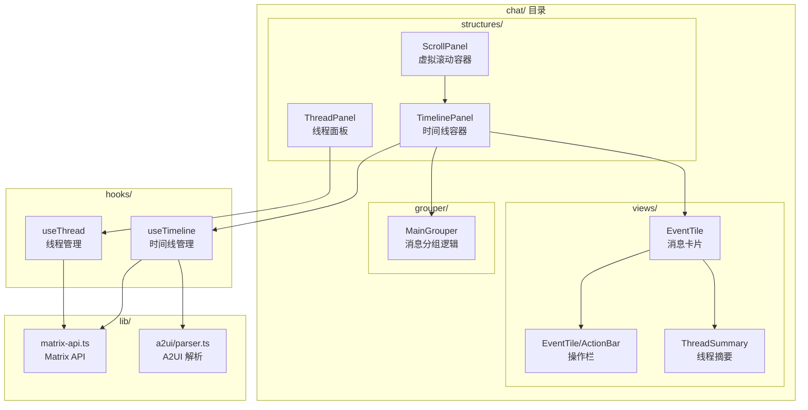

# Matrix 聊天重构技术设计

Feature Name: matrix-chat-refactor
Updated: 2026-08-07

## 描述

基于 element-web 架构重构 Matrix 聊天模块，引入虚拟滚动、消息操作菜单、消息分组、新消息指示器和线程支持，同时保留现有 A2UI 渲染能力。

## 架构



## 组件和接口

### 1. ScrollPanel（虚拟滚动容器）

位置：`src/components/dashboard/sections/chat/structures/ScrollPanel.tsx`

**职责：**
- 管理消息列表的虚拟滚动
- 处理分页加载（向上加载更早消息）
- 维护滚动位置和 sticky bottom 状态

**接口：**
```typescript
interface ScrollPanelProps {
  children: ReactNode;
  hasNextPage: boolean;
  isFetchingNextPage: boolean;
  onLoadMore: () => void;
  autoScroll: boolean;
  onAutoScrollChange: (auto: boolean) => void;
}
```

**实现策略：**
- 使用 `react-virtuoso` 库实现虚拟滚动（element-web 新架构方案）
- 保持与现有 TanStack Query infinite query 集成
- 记录 `trackedScrollToken` 和 `pixelOffset` 维持滚动位置

### 2. TimelinePanel（时间线容器）

位置：`src/components/dashboard/sections/chat/structures/TimelinePanel.tsx`

**职责：**
- 组合 ScrollPanel 和消息列表
- 处理新消息到达时的滚动行为
- 管理阅读标记（Read Marker）

**接口：**
```typescript
interface TimelinePanelProps {
  messages: DisplayMessage[];
  displayItems: DisplayItem[];
  isLoading: boolean;
  hasNextPage: boolean;
  isFetchingNextPage: boolean;
  onConfirmationReply: (reply: string) => Promise<void>;
  threadId?: string;
}
```

### 3. EventTile（消息卡片）

位置：`src/components/dashboard/sections/chat/views/EventTile.tsx`

**职责：**
- 渲染单条消息
- 支持续连模式（隐藏重复发送者）
- 显示线程摘要（如果有回复）
- 管理操作栏的显示/隐藏

**接口：**
```typescript
interface EventTileProps {
  message: DisplayMessage;
  showSender: boolean;
  isContinuation: boolean;
  onConfirmationReply: (reply: string) => Promise<void>;
  onOpenThread?: (threadId: string) => void;
  threadReplyCount?: number;
}
```

**消息类型分发：**
```typescript
const MESSAGE_RENDERERS: Record<string, Component> = {
  'm.text': TextMessage,
  'm.notice': NoticeMessage,
  'm.image': ImageMessage,
  'm.file': FileMessage,
  // A2UI 消息通过 A2uiChatContent 渲染
};
```

### 4. EventTileActionBar（消息操作栏）

位置：`src/components/dashboard/sections/chat/views/EventTile/ActionBar.tsx`

**支持的操作：**
- 复制（Copy）
- 编辑（Edit）- 仅自己的消息
- 删除（Delete）- 仅自己的消息
- 回复（Reply）
- 在线程中回复（Reply in Thread）
- 取消（Cancel）- 发送中
- 重发（Resend）- 发送失败

**触发条件：**
- 桌面端：鼠标悬停
- 移动端：点击消息

### 4.1 消息内容宽度

`MessageBubble` 将普通文本气泡限制为消息列可用宽度的 92%，为左右对齐、头像列与操作栏保留空间。确认、工具调用、思考、流式、A2UI 与 workflow 等结构化内容使用 `max-w-4xl`，在宽面板中减少不必要换行，并由父级可用宽度约束小型面板。

### 5. ThreadPanel（线程面板）

位置：`src/components/dashboard/sections/chat/structures/ThreadPanel.tsx`

**职责：**
- 显示线程内的消息列表
- 支持在线程中发送回复
- 显示线程统计信息

**接口：**
```typescript
interface ThreadPanelProps {
  threadId: string;
  onClose: () => void;
}
```

### 6. MainGrouper（消息分组逻辑）

位置：`src/components/dashboard/sections/chat/grouper/MainGrouper.ts`

**职责：**
- 计算消息是否需要分组（续连）
- 决定何时显示/隐藏发送者信息

**分组规则：**
```typescript
const CONTINUATION_MAX_INTERVAL = 5 * 60 * 1000; // 5分钟

function shouldContinue(prev: DisplayMessage, current: DisplayMessage): boolean {
  return (
    prev.sender === current.sender &&
    current.timestamp - prev.timestamp <= CONTINUATION_MAX_INTERVAL &&
    prev.type === current.type &&
    !isDifferentDay(prev.timestamp, current.timestamp)
  );
}
```

### 7. ReadMarker（阅读标记）

位置：`src/components/dashboard/sections/chat/components/ReadMarker.tsx`

**职责：**
- 记录用户最后阅读的消息
- 显示已读标记线
- 与 Matrix 的 `m.fully_read` 事件同步

## 数据模型

### DisplayMessage 扩展

```typescript
export interface DisplayMessage {
  id: string;
  sender: string;
  senderShort: string;
  content: string;
  formattedContent?: string;
  timestamp: number;
  type: string;
  isMe: boolean;
  status?: 'sending' | 'sent' | 'error';
  mediaUrl?: string;
  mediaInfo?: { mimetype?: string; size?: number; w?: number; h?: number };
  isStreaming?: boolean;
  /** Thread ID if this message has replies */
  threadId?: string;
  /** Number of replies in thread */
  replyCount?: number;
  /** Whether this message has been edited */
  isEdited?: boolean;
  /** Original event ID for edit/delete */
  eventId?: string;
}
```

### Thread 数据模型

```typescript
interface Thread {
  id: string;
  roomId: string;
  rootMessageId: string;
  messages: DisplayMessage[];
  replyCount: number;
  lastReply?: DisplayMessage;
}
```

## 正确性属性

1. **滚动位置保持**：加载新消息时，如果用户不在底部，保持当前滚动位置
2. **续连一致性**：同一发送者的连续消息必须正确识别和分组
3. **线程隔离**：线程内的操作不影响主时间线
4. **已读同步**：阅读标记必须与服务端的 `m.fully_read` 事件同步

## 错误处理

1. **消息发送失败**：显示错误状态，提供重发选项
2. **消息删除失败**：显示错误提示，恢复消息
3. **线程加载失败**：显示错误状态，提供重试按钮
4. **虚拟滚动渲染错误**：降级为普通列表渲染

## 测试策略

1. **单元测试**：
   - `MainGrouper` 分组逻辑
   - `ScrollPanel` 滚动行为
   - `EventTileActionBar` 操作权限
   - `MessageBubble` 的普通消息与 workflow 宽度类

2. **集成测试**：
   - 消息发送和接收
   - 线程回复
   - 虚拟滚动加载

3. **E2E 测试**：
   - 完整聊天流程
   - 多线程操作

## 依赖

```json
{
  "dependencies": {
    "react-virtuoso": "^4.14.0"
  }
}
```

## 迁移计划

### 阶段 1：核心架构
- [ ] 安装 react-virtuoso
- [ ] 创建 ScrollPanel
- [ ] 创建 TimelinePanel
- [ ] 迁移现有消息渲染逻辑

### 阶段 2：消息操作
- [ ] 创建 EventTileActionBar
- [ ] 实现复制、编辑、删除功能
- [ ] 实现回复功能

### 阶段 3：消息分组
- [ ] 创建 MainGrouper
- [ ] 实现续连逻辑
- [ ] 更新 EventTile 支持分组

### 阶段 4：新消息指示器
- [ ] 创建 NewMessagesBadge
- [ ] 实现阅读标记
- [ ] 集成到 TimelinePanel

### 阶段 5：线程支持
- [ ] 创建 ThreadPanel
- [ ] 实现线程消息加载
- [ ] 集成到 EventTile

### 阶段 6：优化和测试
- [ ] 性能优化
- [ ] 边界情况处理
- [ ] 完整测试覆盖
