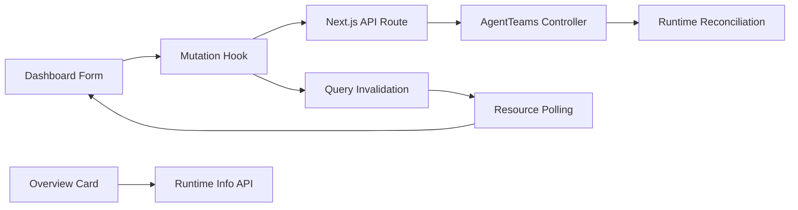

# MVP Dashboard 精简设计

Feature Name: mvp-dashboard-simplification
Updated: 2026-07-29

## Description

本设计将 Dashboard 收敛为资源管理 MVP。导航从分组模型切换为七个一级入口；团队表单统一处理两种逗号；mutation 统一刷新查询并在异步调谐期间呈现状态；总览新增运行信息卡片。

## Architecture



浏览器继续经由 Dashboard API 路由访问 Controller 和 Matrix。Dashboard 服务端提供构建版本与进程启动时间，Controller 提供运行版本和可用的运行状态。客户端统一以 TanStack Query 的失效、重新获取和轮询结果表达已接受与已生效状态。

## Components and Interfaces

### 团队创建表单

`TeamCreateDialog` 将成员输入解析为 `workerNames`。解析器接受英文逗号 `,` 和中文逗号 `，`，修剪名称前后空白，并忽略空值。呈现器以 `, ` 连接保存名称，保证输入值稳定。

### MVP 导航

`nav-items.ts` 定义七个不带 `group` 的一级入口：`overview`、`workers`、`teams`、`managers`、`humans`、`chat` 和 `docs`。侧边栏和移动侧边栏复用该列表。`use-active-section` 将无法匹配当前导航项的哈希回退至 `overview`。

### 资源操作状态

mutation hook 对每个写操作失效对应资源查询和集群状态查询。生命周期操作在 mutation pending 期间禁用触发控件。Worker 生命周期操作和团队创建后的调谐使用 `pending` 状态记录目标资源、目标状态、开始时间和最近查询时间。

资源轮询周期沿用现有 15 秒资源查询。状态协调器在响应达到目标阶段时清除等待记录，在 60 秒后持续展示等待消息和最近查询时间。

### 配置能力审计

保留模块按字段建立写入接口映射：

| 模块 | 写入接口 | MVP 保留字段 |
|---|---|---|
| Workers | `/api/v1/workers` | Controller 接受的创建、更新和生命周期字段 |
| 团队 | `/api/v1/teams` | 名称、Leader、显示名称、描述和 Worker 成员 |
| Managers | `/api/v1/managers` | Controller 接受的创建和更新字段 |
| Humans | `/api/v1/humans` | Controller 接受的创建和更新字段 |
| Matrix 聊天 | Matrix Client API | 登录、房间和消息字段 |

审计发现无写入接口或无运行时消费路径的字段后，从表单与详情视图移除该字段。AI 网关、平台、治理与基础设施不在 MVP 导航中出现。

### 运行信息卡片

新增 Dashboard 运行信息 API，返回 Dashboard 仓库地址、Dashboard 版本、Dashboard 启动时间和计算后的运行时长。总览通过现有 `useVersion` 获取 AgentTeams Controller 版本。当前 Controller 版本接口未提供运行时长，运行信息卡片将该字段呈现为接口未提供。仓库地址为构建时常量，版本来自 Dashboard `package.json` 与 Controller API。

## Data Models

```ts
interface RuntimeInfo {
  agentteams: {
    repository: string;
    version: string | null;
    uptimeSeconds: number | null;
  };
  dashboard: {
    repository: string;
    version: string;
    uptimeSeconds: number;
  };
  refreshedAt: string;
}

interface PendingReconciliation {
  resourceType: 'worker' | 'team' | 'manager' | 'human';
  resourceName: string;
  targetState: string;
  startedAt: number;
  lastCheckedAt: number | null;
}
```

## Correctness Properties

1. 团队成员解析结果仅包含去除首尾空白的非空 Worker 名称。
2. 当前激活节始终属于 MVP 导航列表；未知节回退到总览。
3. 每个成功 mutation 都至少失效对应资源查询和集群状态查询。
4. 等待生效记录只在轮询确认目标状态或操作失败后移除。
5. 运行信息卡片不包含令牌、密码或 Controller URL 中的凭据。

## Error Handling

| 场景 | Dashboard 行为 |
|---|---|
| 团队成员输入包含连续分隔符 | 忽略空名称并保留有效名称 |
| mutation 请求失败 | 展示操作失败消息、恢复可操作控件并保留查询数据 |
| 调谐超过 60 秒 | 展示等待状态与最近查询时间 |
| Controller 版本或运行时长不可用 | 展示未知状态和刷新入口 |
| 旧导航哈希指向已隐藏模块 | 导航到总览 |

## Test Strategy

1. 单元测试覆盖中英文逗号、空白和连续分隔符的成员解析与呈现。
2. 导航测试覆盖七个一级入口、移动导航和隐藏模块哈希回退。
3. mutation 测试覆盖每类资源的查询失效、进行中状态和等待状态清理。
4. 组件测试覆盖运行信息卡片的完整数据、部分未知数据和刷新行为。
5. API 路由测试覆盖 Dashboard 版本、仓库信息和启动时间的返回结构。

## References

[^1]: `src/components/dashboard/sections/teams/team-create-dialog.tsx` - 团队成员输入。
[^2]: `src/components/dashboard/nav-items.ts` - 当前导航模型。
[^3]: `src/hooks/use-agentteams-mutations.ts` - 资源 mutation 与查询失效。
[^4]: `src/hooks/use-agentteams-version.ts` - Controller 版本查询。
