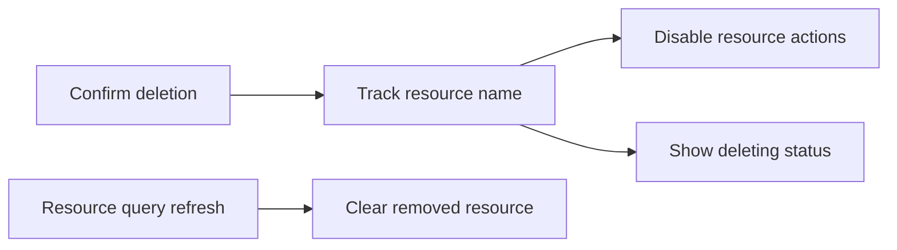

# 资源删除锁定设计

Feature Name: resource-deletion-lock
Updated: 2026-07-29

## Description

Worker 和团队 section 分别维护删除中资源名称集合。删除开始时将资源加入集合，资源查询不再返回该名称或删除失败时移除。展示组件以资源名称判断锁定状态。

## Architecture

## Components and Interfaces

- `useDeleteWorker`：删除期间保留 Worker 查询缓存。
- `WorkersSection`、`TeamsSection`：维护删除中名称集合。
- `WorkerCard`、`WorkerTable`、`TeamCard`、`TeamTable`：接收并呈现逐资源删除状态。

## Correctness Properties

- 删除中资源仅允许详情操作。
- 删除状态与资源名称绑定，互不影响列表中的其他资源。
- 查询确认资源移除后，删除状态自动消失。

## Error Handling

- 删除请求失败时，资源恢复全部操作入口。
- 查询暂时失败时，已跟踪资源保持删除中状态。

## Test Strategy

- 覆盖删除期间 Worker 与团队操作禁用状态。
- 覆盖详情操作在删除期间保持可用。
- 覆盖资源查询移除名称后的状态清理。
