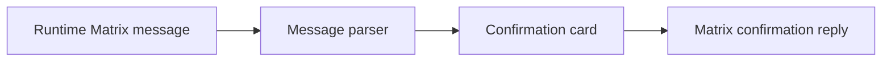

# 运行时确认卡片设计

Feature Name: runtime-confirmation-cards
Updated: 2026-07-29

## Description

确认卡片将接入 Matrix 消息解析与聊天内容渲染层。第一阶段支持 Tool Guard 文本确认协议：消息同时包含双语等待审批标题和 `Type /approve to approve, or send any message to deny.` 指令时，批准操作发送 `/approve`，拒绝操作发送 `拒绝`。

## Architecture

## Components and Interfaces

- `parseA2uiContent`：识别 Tool Guard 确认消息并生成确认块。
- `A2uiChatContent`：提供确认卡片及辅助卡片的展示实现。
- `ChatPanel`：向产生确认请求的当前 Matrix 房间发送确认回复。

## Open Decision

扩展至 CoPaw、QwenPaw、OpenClaw 和 Hermes 前需要确认以下运行时协议之一：

- 提供每种运行时实际发出的确认 Matrix 事件及批准、拒绝回复示例。
- 确认四种运行时共同接受的标准字段和回复文本。

## Correctness Properties

- 确认操作只向产生确认请求的房间发送回复。
- 已完成确认请求不能重复提交。
- 未识别消息保留现有渲染路径。

## Test Strategy

- 为每种确认事件样本覆盖解析、卡片状态和发送回复。
- 覆盖流式与完成状态下思考、工具调用卡片的默认展开行为。
