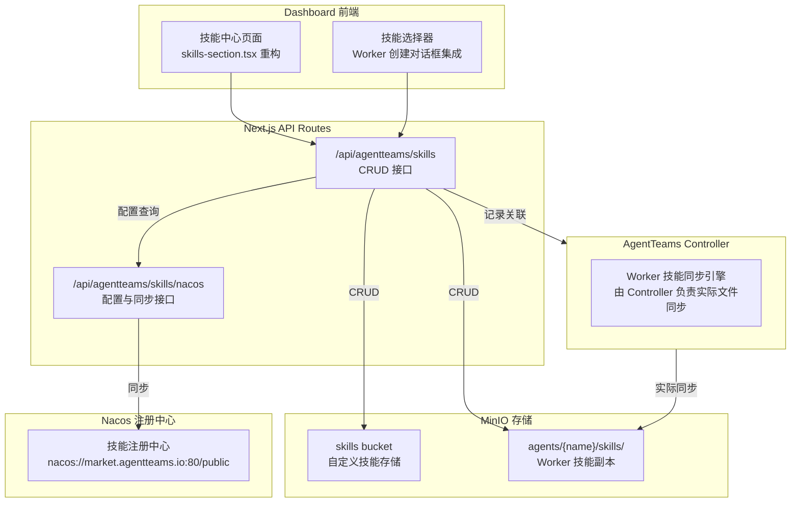

# 设计文档：技能中心（Skill Center）

Feature Name: skill-center
Updated: 2026-08-03

## 描述

将现有分散的技能管理机制重构为统一的「技能中心」模块，提供：

1. 集中化的技能管理界面（表格形式，支持增删改查）
2. Nacos 注册中心对接（支持手动/定时同步）
3. Worker 创建流程中的技能选择能力
4. 技能来源标识（自定义 vs Nacos）

---

## 架构



---

## 组件与接口

### 1. 技能中心页面组件

**位置**：`src/components/dashboard/sections/skills/skill-center.tsx`（新建）

**职责**：
- 渲染技能列表表格
- 提供上传、编辑、删除操作入口
- 显示技能来源标识（自定义 / Nacos 别名）
- 支持搜索和筛选

**接口**：

```typescript
interface SkillCenterProps {
  nacosConfig?: NacosConfig | null;
  onNacosConfigChange?: (config: NacosConfig) => void;
}
```

**表格列定义**：

| 列名 | 内容 | 可操作 |
|------|------|--------|
| 技能名称 | `skill.name` | 链接到详情 |
| 描述 | `skill.description` | - |
| 来源 | `source`（自定义 / Nacos 别名） | 标签展示 |
| 版本 | `skill.version`（可选） | - |
| 文件数 | `skill.fileCount` | - |
| 操作 | 编辑 / 删除（自定义技能） | 按钮组 |

---

### 2. 技能上传对话框

**位置**：`src/components/dashboard/sections/skills/skill-upload-dialog.tsx`（新建）

**职责**：
- 拖拽或选择 ZIP 文件上传
- 显示解析后的技能预览（名称、描述、文件列表）
- 处理同名冲突（覆盖确认 / 取消）

**接口**：

```typescript
interface SkillUploadDialogProps {
  open: boolean;
  onOpenChange: (open: boolean) => void;
  onSuccess?: (skill: SkillEntry) => void;
}
```

---

### 3. Nacos 配置对话框

**位置**：`src/components/dashboard/sections/skills/nacos-config-dialog.tsx`（新建）

**职责**：
- 配置 Nacos 注册中心 URL、命名空间、认证信息
- 支持手动触发同步
- 显示同步状态和历史

**接口**：

```typescript
interface NacosConfigDialogProps {
  open: boolean;
  onOpenChange: (open: boolean) => void;
  initialConfig?: NacosConfig;
  onSync?: () => Promise<void>;
}
```

---

### 4. 技能选择器组件

**位置**：`src/components/dashboard/sections/skills/skill-selector.tsx`（新建）

**职责**：
- 提供模糊搜索的技能多选界面
- 显示技能来源和基本信息
- 支持按来源筛选

**接口**：

```typescript
interface SkillSelectorProps {
  value: string[];
  onChange: (skills: string[]) => void;
  placeholder?: string;
}
```

---

### 5. API 路由

#### 5.1 技能 CRUD

**位置**：`src/app/api/agentteams/skills/route.ts`（新建）

**GET** — 获取技能列表：
```typescript
// Query params: search?, source?, page?, pageSize?
// Response: { skills: SkillEntry[], total: number }
```

**POST** — 上传技能包：
```typescript
// Content-Type: multipart/form-data
// Body: { file: File }
// Response: { success: boolean, skill: SkillEntry }
```

#### 5.2 单个技能操作

**位置**：`src/app/api/agentteams/skills/[name]/route.ts`（新建）

**GET** — 获取技能详情：
```typescript
// Response: { skill: SkillEntry, files: string[] }
```

**PUT** — 更新技能元信息：
```typescript
// Body: { description?: string, version?: string }
// Response: { success: boolean, skill: SkillEntry }
```

**DELETE** — 删除技能：
```typescript
// Response: { success: boolean }
```

#### 5.3 Nacos 配置

**位置**：`src/app/api/agentteams/skills/nacos/config/route.ts`（新建）

**GET** — 获取 Nacos 配置：
```typescript
// Response: { config: NacosConfig | null }
```

**PUT** — 更新 Nacos 配置：
```typescript
// Body: { registryUrl: string, namespace: string, username?: string, password?: string }
// Response: { success: boolean }
```

#### 5.4 Nacos 同步

**位置**：`src/app/api/agentteams/skills/nacos/sync/route.ts`（新建）

**POST** — 手动触发同步：
```typescript
// Response: { success: boolean, synced: number, errors?: string[] }
```

---

### 6. Hooks

#### 6.1 技能列表

**位置**：`src/hooks/use-skill-center.ts`（新建）

```typescript
function useSkills(search?: string, source?: 'custom' | 'nacos' | null): UseQueryResult<SkillEntry[]>
function useSkill(name: string): UseQueryResult<SkillEntry | null>
function useCreateSkill(): UseMutationResult<SkillEntry>
function useUpdateSkill(): UseMutationResult<SkillEntry>
function useDeleteSkill(): UseMutationResult<void>
```

#### 6.2 Nacos 配置

**位置**：`src/hooks/use-nacos-config.ts`（新建）

```typescript
function useNacosConfig(): UseQueryResult<NacosConfig | null>
function useUpdateNacosConfig(): UseMutationResult<void>
function useNacosSync(): UseMutationResult<{ synced: number }>
```

---

## 数据模型

### SkillEntry

```typescript
interface SkillEntry {
  name: string;              // 技能唯一标识，正则 /^[A-Za-z0-9][A-Za-z0-9._-]*$/
  description: string;       // 技能描述
  source: 'custom' | 'nacos';
  sourceAlias?: string;      // Nacos 注册中心别名，source='nacos' 时必填
  version?: string;          // 可选版本信息
  createdAt: string;         // ISO 8601
  updatedAt: string;         // ISO 8601
  fileCount: number;         // 技能包内文件数量
}
```

### NacosConfig

```typescript
interface NacosConfig {
  registryUrl: string;       // 例如：nacos://market.agentteams.io:80/public
  namespace: string;         // Nacos 命名空间，默认 'public'
  username?: string;         // 可选
  password?: string;         // 可选
  lastSyncAt?: string;       // 最后同步时间
  lastSyncStatus?: 'success' | 'error';
  lastSyncError?: string;    // 失败时的错误信息
}
```

---

## 正确性属性

### 不变量

1. **技能名称唯一性**：同一来源（custom 或 nacos+alias）下，技能名称 SHALL 唯一
2. **MinIO Bucket 存在性**：上传技能前，system SHALL 确保 `skills` bucket 存在
3. **Nacos 技能不可修改**：source='nacos' 的技能 SHALL 禁止编辑和删除
4. **Worker 关联完整性**：删除技能前，system SHALL 检查是否有 Worker 引用该技能

### 约束

1. **上传文件大小**：最大 64 MB
2. **技能包格式**：必须包含有效的 SKILL.md（含 name 和 description）
3. **Nacos URL 格式**：必须为 `nacos://host:port/namespace` 格式

---

## 错误处理

| 场景 | 处理方式 |
|------|----------|
| MinIO 未配置 | 返回 503，提示用户配置 MinIO |
| 技能包格式无效 | 返回 400，提示具体错误（缺少 SKILL.md、字段缺失等） |
| 技能名冲突 | 返回 409，提示用户选择覆盖或取消 |
| Nacos 同步失败 | 记录错误，不阻塞技能列表展示 |
| 技能文件缺失 | 删除时返回 404，提示技能不存在 |

---

## 测试策略

### 单元测试

- `src/lib/skill-package.test.ts`：扩展验证 SKILL.md 解析
- `src/app/api/agentteams/skills/route.test.ts`：API 路由测试

### 集成测试

- 技能上传完整流程（ZIP 验证、MinIO 写入、列表刷新）
- Nacos 配置与同步流程
- Worker 创建时技能选择流程

### E2E 测试

- 技能中心页面操作流程
- 技能选择器在 Worker 创建中的使用

---

## 实现计划

### Phase 1: 基础设施

1. 新建 API 路由：`/api/agentteams/skills`
2. 新建 API 路由：`/api/agentteams/skills/[name]`
3. 新建 API 路由：`/api/agentteams/skills/nacos/config`
4. 新建 API 路由：`/api/agentteams/skills/nacos/sync`
5. 新建 Hooks：`useSkills`, `useSkill`, `useNacosConfig`, `useNacosSync`

### Phase 2: 技能中心页面

1. 新建组件：`SkillCenter`
2. 新建组件：`SkillUploadDialog`
3. 新建组件：`NacosConfigDialog`
4. 重构 `SkillsSection` 集成 SkillCenter

### Phase 3: Worker 创建集成

1. 新建组件：`SkillSelector`
2. 修改 `WorkerCreateDialog` 集成 SkillSelector
3. 修改 `CreateWorkerRequest` 添加技能关联字段
4. 修改 API 路由传递技能选择

### Phase 4: 优化与测试

1. 添加 Nacos 定时同步逻辑
2. 添加技能名称冲突处理
3. 编写单元测试和集成测试
4. 性能优化（分页、缓存）

---

## 参考

[^1]: `src/lib/skill-package.ts` - 现有技能包解析逻辑
[^2]: `src/app/api/agentteams/packages/route.ts` - 现有技能上传路由
[^3]: `src/app/api/agentteams/workers/[name]/skills/route.ts` - 现有 Worker 技能路由
[^4]: `install/agentteams-install.sh` - Nacos 配置相关环境变量
